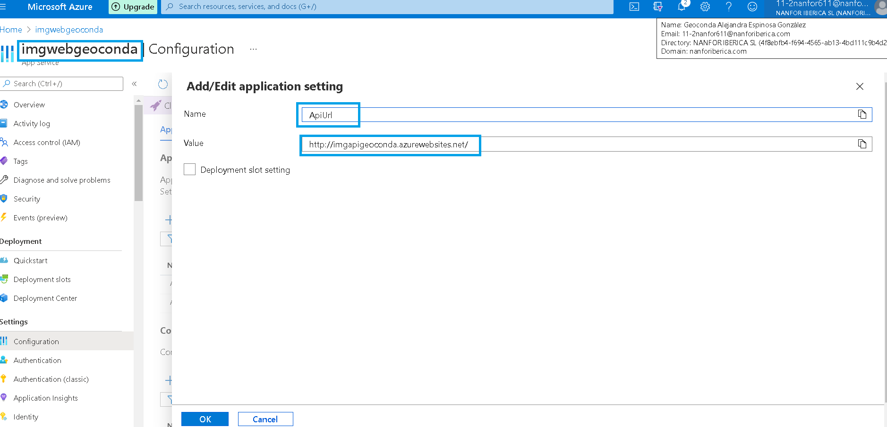

# Lab 01: Building a web application on Azure platform as a service offerings

## Architecture:


**Resultado de la creación de los App Service Web y Api: **


**Connection String to storage account:**

```
DefaultEndpointsProtocol=https;AccountName=imgstoregeoconda;AccountKey=XqqBTr169L/qkciJe1l/hMD6bt2ofWfVtpqfxIym4Mog47kx+gSqBZFqF4HyQfoJLDs7g/qwVuqi87qm/3hirQ==;EndpointSuffix=core.windows.net
```

**URL WEB API:**

```
http://imgapigeoconda.azurewebsites.net/
```

**Configuracion de la API Web**


**Configuración de la Web App**


**Código Az-CLI para desplegar el api rest**

```
az webapp deployment source config-zip --resource-group ManagedPlatform --src api.zip --name imgapigeoconda
```

**Código Az-CLI para desplegar el web app**

``` 
az webapp deployment source config-zip --resource-group ManagedPlatform --src web.zip --name imgwebgeoconda
```


**Comprobación que las web api funcione correctamente **


**Comprobación que la web app funcione correctamente **

