# Lab 02: Implement task processing logic by using Azure Functions

## Architecture:


### Crear una Store Account dentro de un Resource Group llamado Serverless. 


### Crear una Function App. 

### Connection String Key 1:

```
DefaultEndpointsProtocol=https;AccountName=funcstorgeoconda;AccountKey=2Y+fcKbyCujCLFrR4hjgXIk9pQbEmS0yEiaMdOYNxxaiFNwxamJfvKPgDI55yne/JbJson00nar1PrqoEvG3aA==;EndpointSuffix=core.windows.net
```


### Configure local Azure Functions project.


*Codigo usado par configurar la cadena de conexión*
```
{
    "IsEncrypted": false,
    "Values": {
        "AzureWebJobsStorage": "DefaultEndpointsProtocol=https;AccountName=funcstorgeoconda;AccountKey=2Y+fcKbyCujCLFrR4hjgXIk9pQbEmS0yEiaMdOYNxxaiFNwxamJfvKPgDI55yne/JbJson00nar1PrqoEvG3aA==;EndpointSuffix=core.windows.net",
        "FUNCTIONS_WORKER_RUNTIME": "dotnet"
    }
}
```

### Crear una HTTP-triggered function
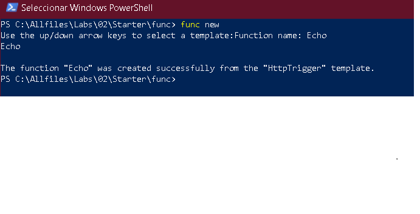
### Escribir un HTTP-triggered function code
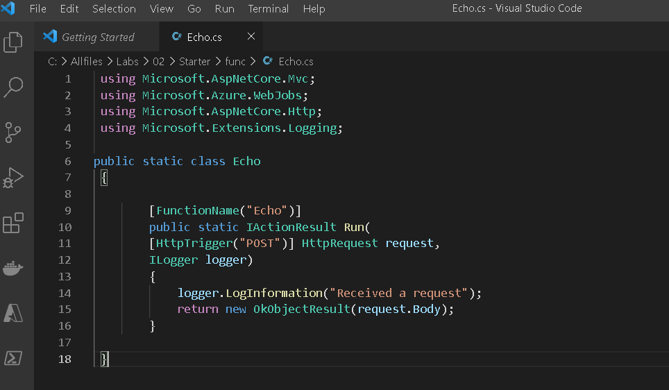

### Test the HTTP-triggered function by using httprepl
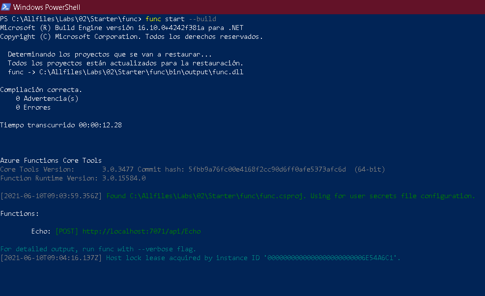
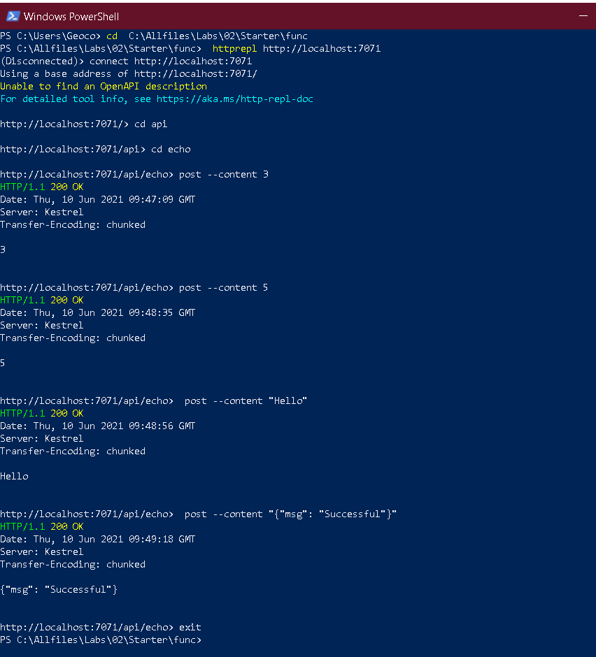
### Create a function that triggers on a schedule
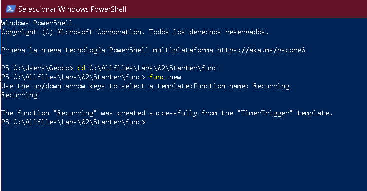

*Codigo usado para la task 4: Update the function integration configuration*
```
using System;
using Microsoft.Azure.WebJobs;
using Microsoft.Azure.WebJobs.Host;
using Microsoft.Extensions.Logging;

namespace func
{
    public static class Recurring
    {
         [FunctionName("Recurring")]
         public static void Run([TimerTrigger("*/30 * * * * *")]TimerInfo myTimer, ILogger log)
        {
            log.LogInformation($"C# Timer trigger function executed at: {DateTime.Now}");
        }
    }
}
```

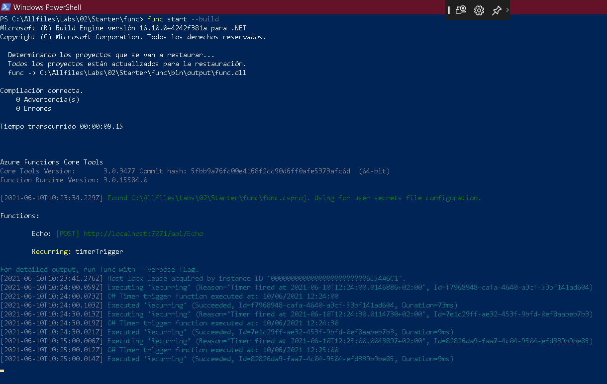

### Crear una función que se integre con otros servicios.

*Subir un archivo en un contenedor nuevo llamado content, dentro de mi funcstorgeoconda*
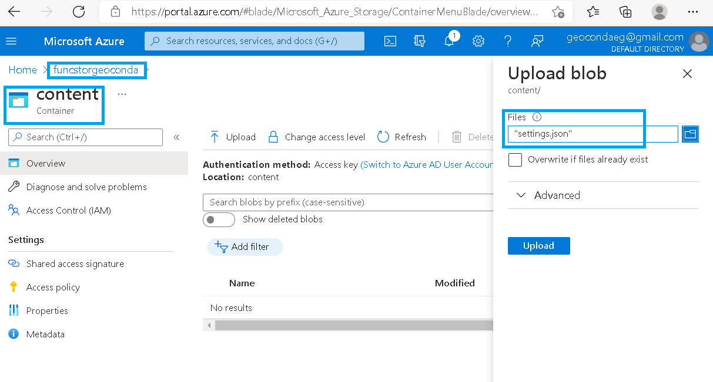
*Crear una HTTP-triggered function.
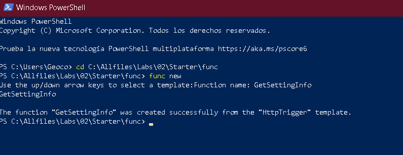
*Escribri una HTTP-triggered a blob-inputted function code*
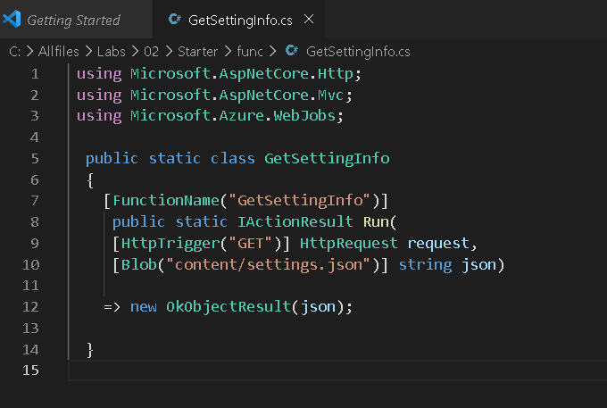
*Registrar extensiones de blob de Azure Storage*
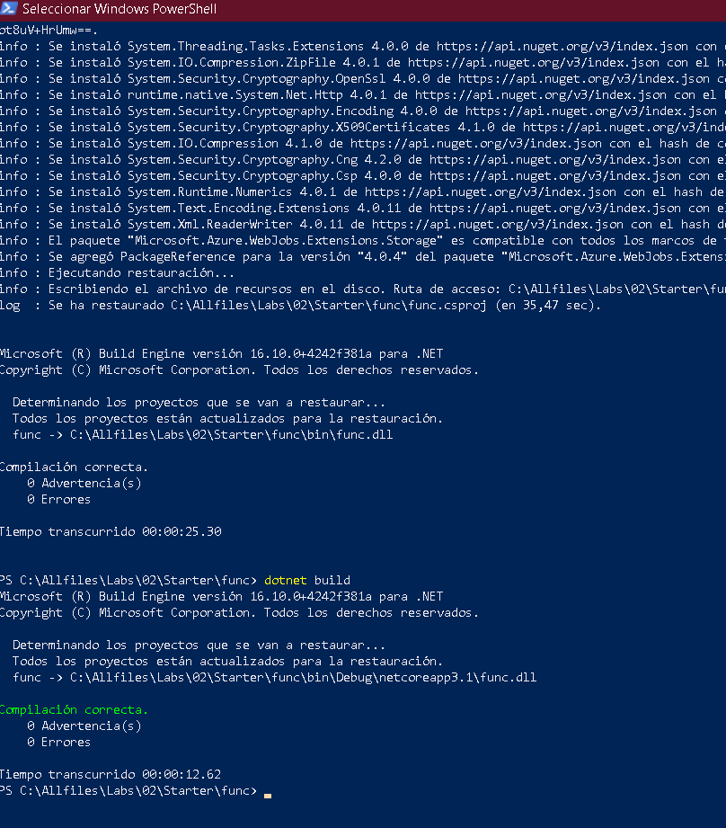

*Test de la funcion usando httprepl*
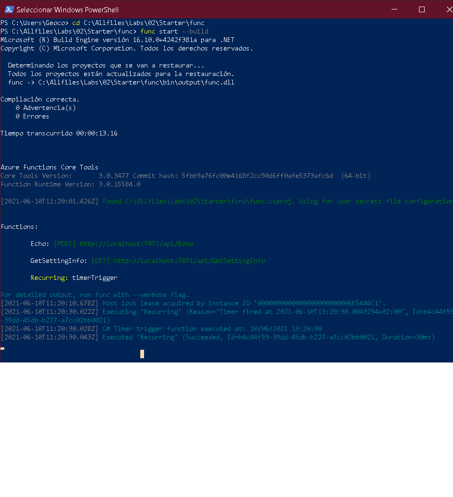
*código httprepl*
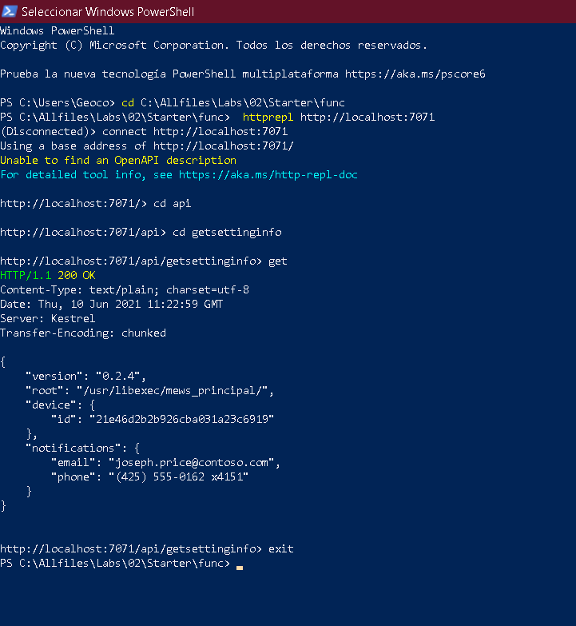
*Publish the function app project*
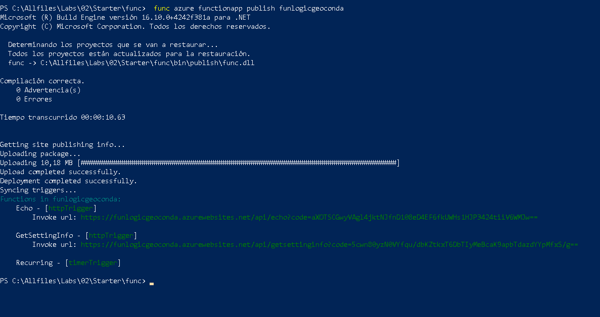
### Validate deployment
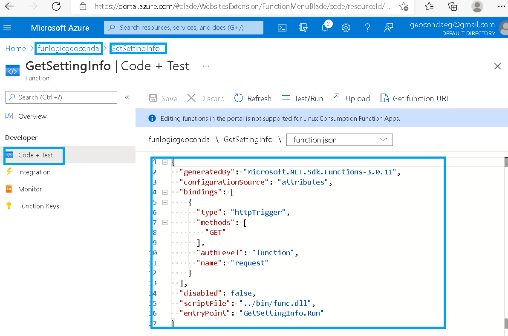
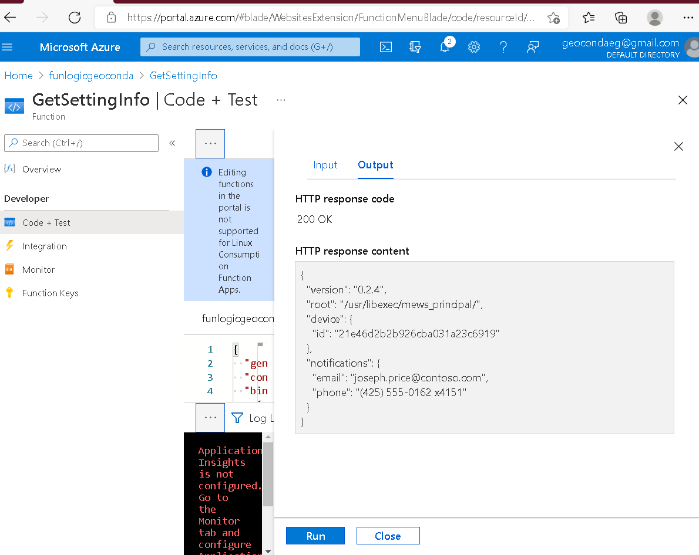

