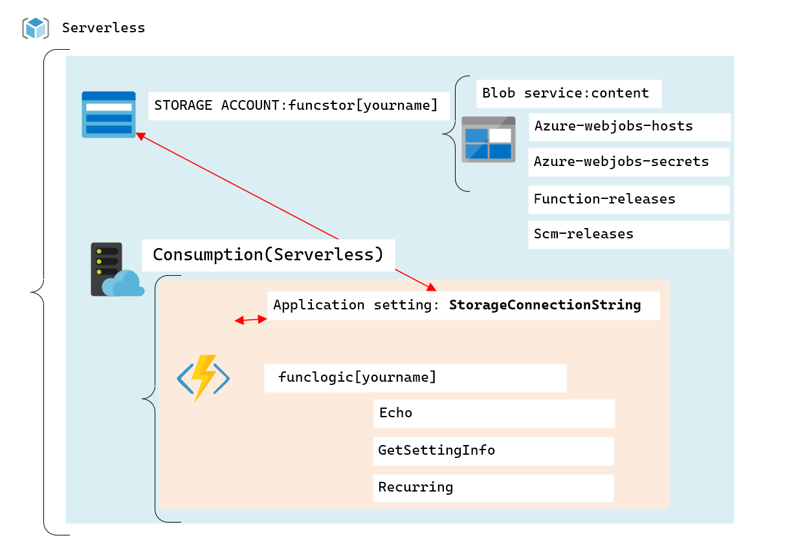
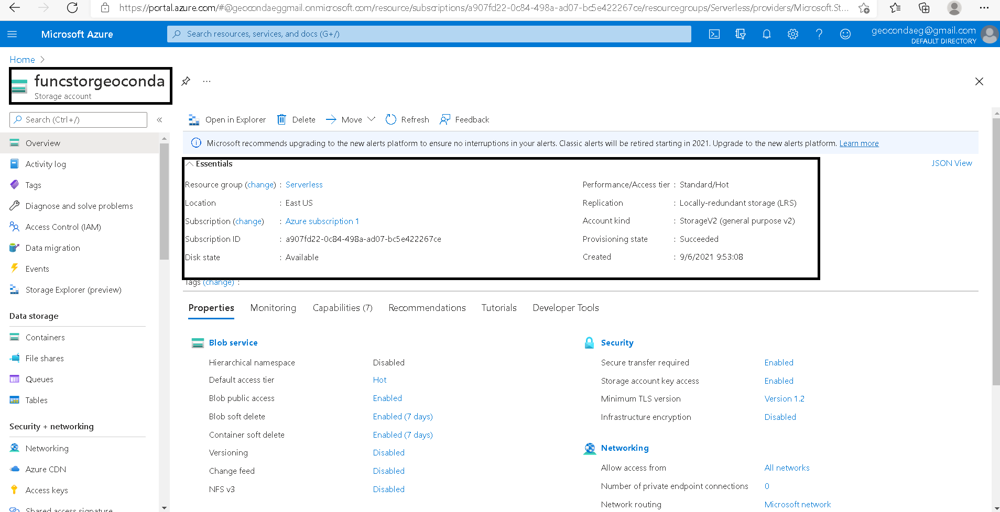
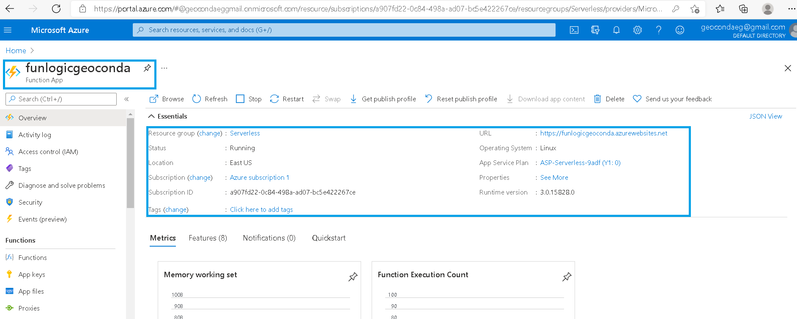
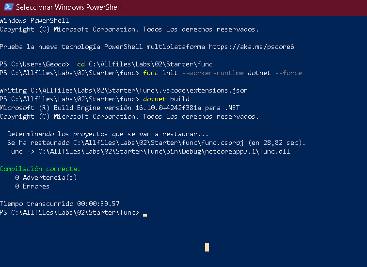

# Lab 02: Implement task processing logic by using Azure Functions

## Architecture:



### Crear una Store Account dentro de un Resource Group llamado Serverless. 


### Crear una Function App. 

### Connection String Key 1:

```
DefaultEndpointsProtocol=https;AccountName=funcstorgeoconda;AccountKey=2Y+fcKbyCujCLFrR4hjgXIk9pQbEmS0yEiaMdOYNxxaiFNwxamJfvKPgDI55yne/JbJson00nar1PrqoEvG3aA==;EndpointSuffix=core.windows.net
```


### Configure local Azure Functions project.



```
{
    "IsEncrypted": false,
    "Values": {
        "AzureWebJobsStorage": "DefaultEndpointsProtocol=https;AccountName=funcstorgeoconda;AccountKey=2Y+fcKbyCujCLFrR4hjgXIk9pQbEmS0yEiaMdOYNxxaiFNwxamJfvKPgDI55yne/JbJson00nar1PrqoEvG3aA==;EndpointSuffix=core.windows.net",
        "FUNCTIONS_WORKER_RUNTIME": "dotnet"
    }
}
```
