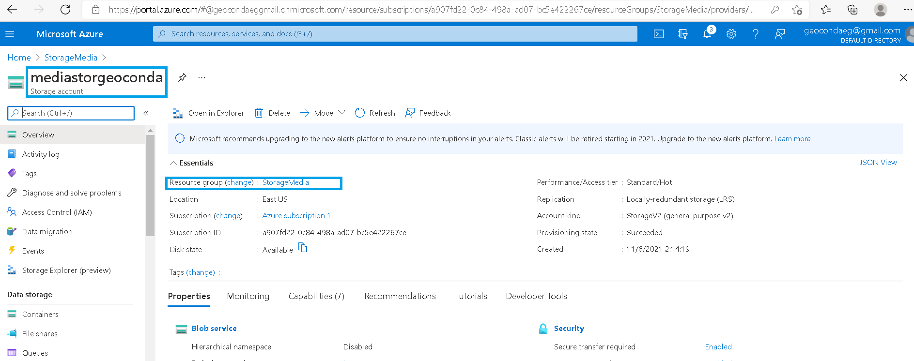
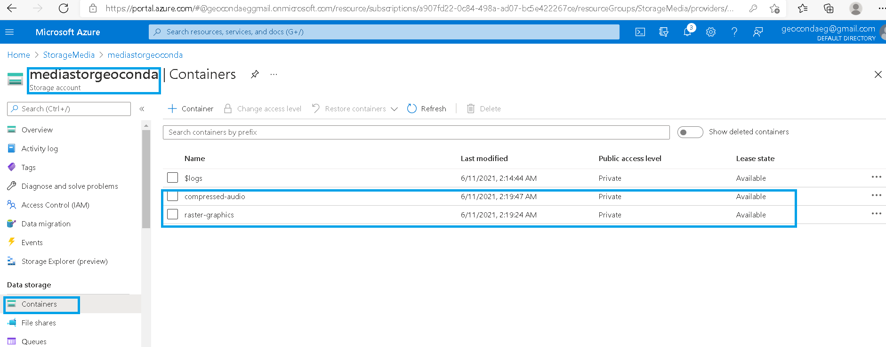
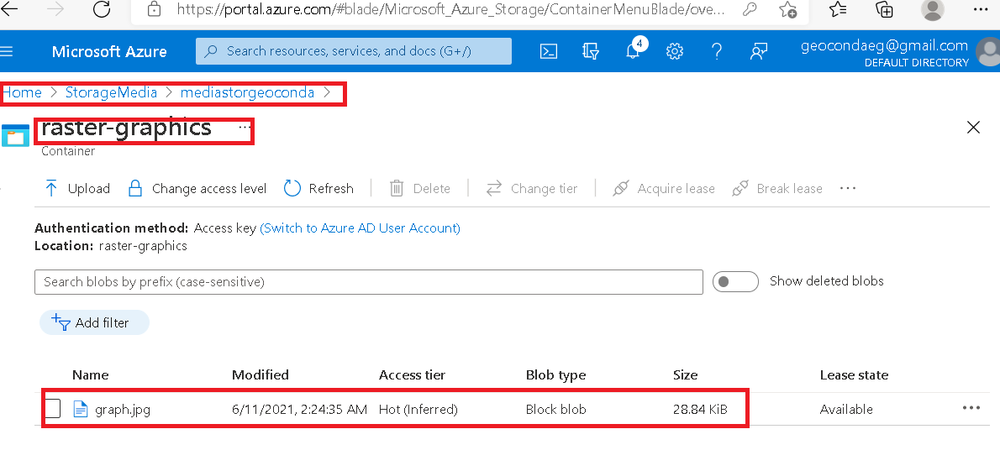
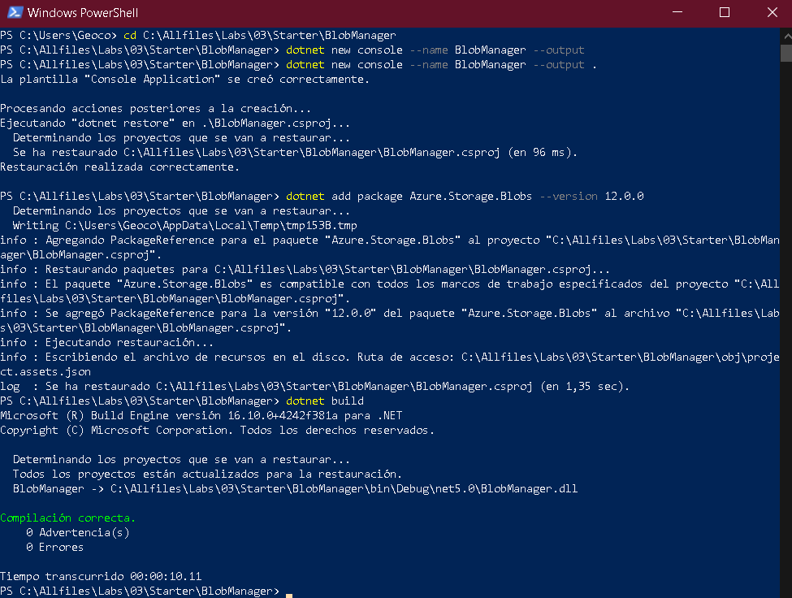
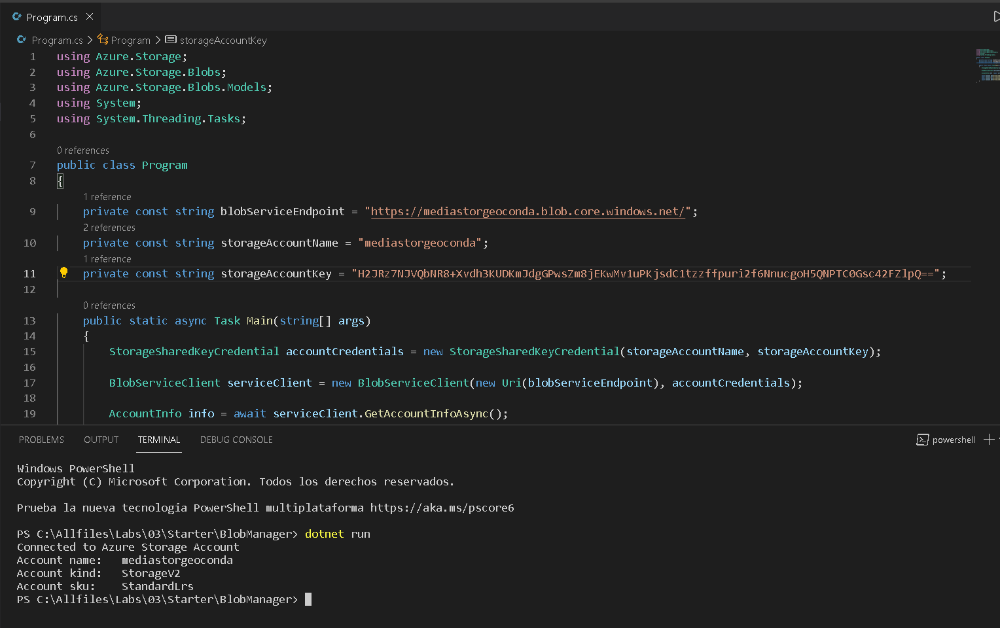
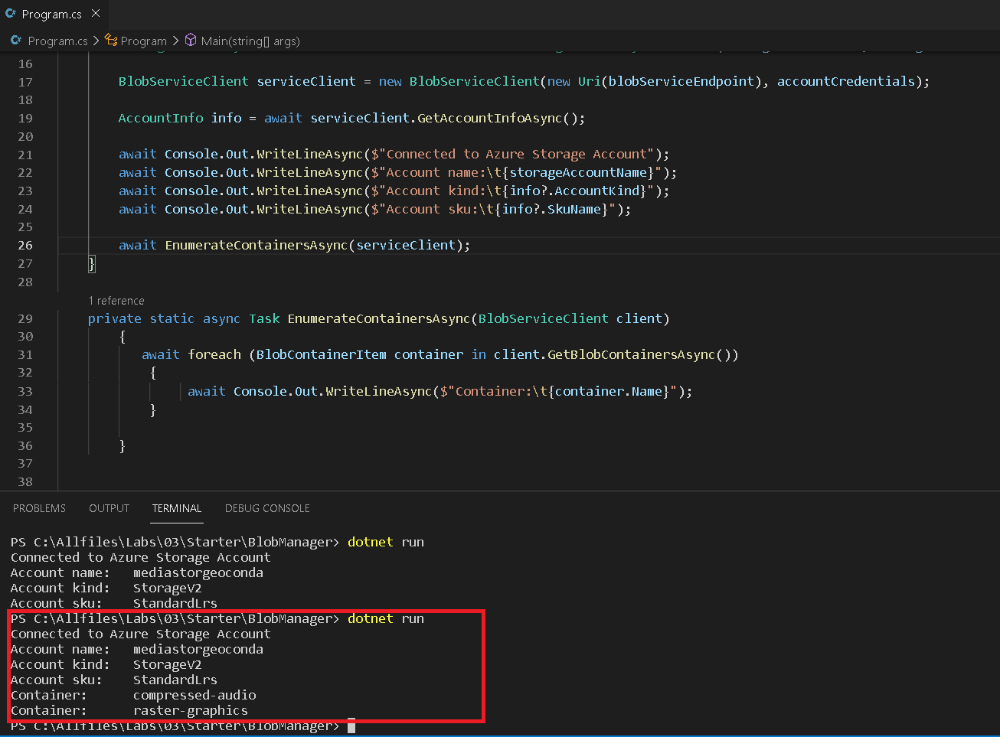
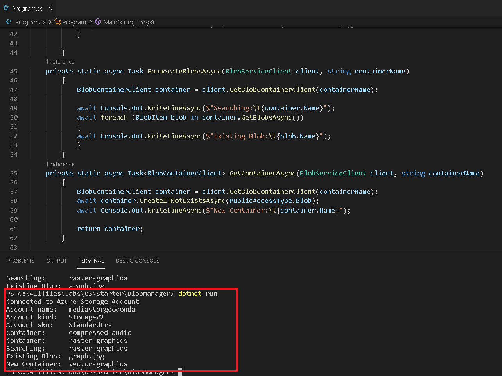
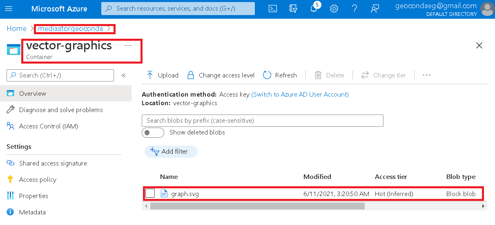
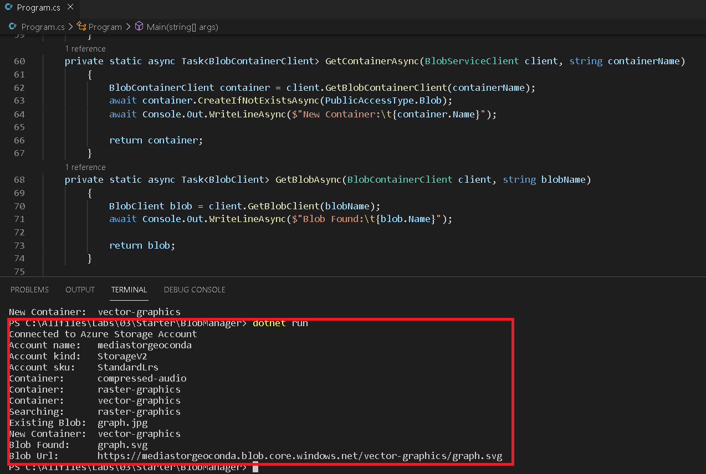
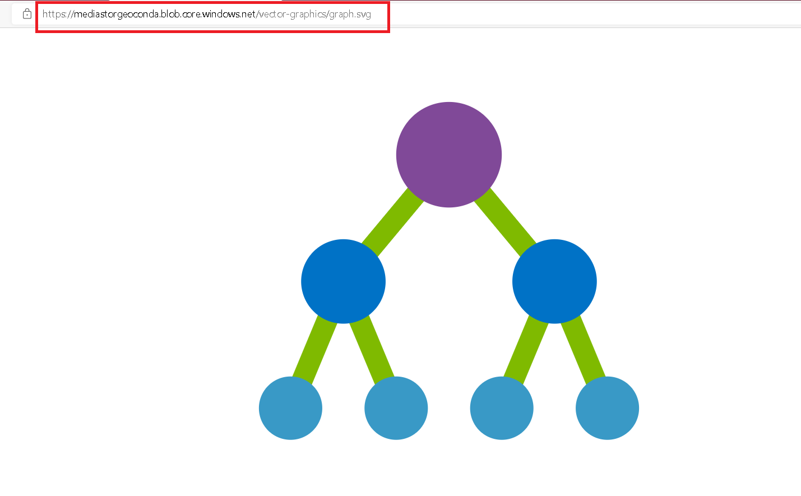

# Lab 03: Retrieving Azure Storage resources and metadata by using the Azure Storage SDK for .NET

## Objectives

*Create containers and upload blobs by using the Azure portal.

*Enumerate blobs and containers by using the Microsoft Azure Storage SDK for .NET.

*Pull blob metadata by using the Storage SDK.

### Crear una Storage Account 


### Crear 2 contenedores en mi Storage Account

### Subir una imagen a uno de mis contenedores

### Crear un .Net project

## Modificar  Program.cs para acceder a mi Storage usando los siguientes codigos.


```
using Azure.Storage;
using Azure.Storage.Blobs;
using Azure.Storage.Blobs.Models;
using System;
using System.Threading.Tasks;

public class Program
{
    private const string blobServiceEndpoint = "https://mediastorgeoconda.blob.core.windows.net/";
    private const string storageAccountName = "mediastorgeoconda";
    private const string storageAccountKey = "H2JRz7NJVQbNR8+Xvdh3KUDKmJdgGPwsZm8jEKwMv1uPKjsdC1tzzffpuri2f6NnucgoH5QNPTC0Gsc42FZlpQ==";
        
    public static async Task Main(string[] args)
    {
        StorageSharedKeyCredential accountCredentials = new StorageSharedKeyCredential(storageAccountName, storageAccountKey);

        BlobServiceClient serviceClient = new BlobServiceClient(new Uri(blobServiceEndpoint), accountCredentials);

        AccountInfo info = await serviceClient.GetAccountInfoAsync();

        await Console.Out.WriteLineAsync($"Connected to Azure Storage Account");
        await Console.Out.WriteLineAsync($"Account name:\t{storageAccountName}");
        await Console.Out.WriteLineAsync($"Account kind:\t{info?.AccountKind}");
        await Console.Out.WriteLineAsync($"Account sku:\t{info?.SkuName}");

        await EnumerateContainersAsync(serviceClient);

        string existingContainerName = "raster-graphics";
        await EnumerateBlobsAsync(serviceClient, existingContainerName);

        string newContainerName = "vector-graphics";
        BlobContainerClient containerClient = await GetContainerAsync(serviceClient, newContainerName);

        string uploadedBlobName = "graph.svg";
        BlobClient blobClient = await GetBlobAsync(containerClient, uploadedBlobName);

        await Console.Out.WriteLineAsync($"Blob Url:\t{blobClient.Uri}");


    }

    private static async Task EnumerateContainersAsync(BlobServiceClient client)
        {  
           await foreach (BlobContainerItem container in client.GetBlobContainersAsync())
            {
                 await Console.Out.WriteLineAsync($"Container:\t{container.Name}");
            }       
      
        }
    private static async Task EnumerateBlobsAsync(BlobServiceClient client, string containerName)
        {      
            BlobContainerClient container = client.GetBlobContainerClient(containerName);

            await Console.Out.WriteLineAsync($"Searching:\t{container.Name}");
            await foreach (BlobItem blob in container.GetBlobsAsync())
            {
            await Console.Out.WriteLineAsync($"Existing Blob:\t{blob.Name}");
            }
        }
    private static async Task<BlobContainerClient> GetContainerAsync(BlobServiceClient client, string containerName)
        {
            BlobContainerClient container = client.GetBlobContainerClient(containerName);
            await container.CreateIfNotExistsAsync(PublicAccessType.Blob); 
            await Console.Out.WriteLineAsync($"New Container:\t{container.Name}");

            return container;
        }
    private static async Task<BlobClient> GetBlobAsync(BlobContainerClient client, string blobName)
        {
            BlobClient blob = client.GetBlobClient(blobName);
            await Console.Out.WriteLineAsync($"Blob Found:\t{blob.Name}");
            
            return blob;
        }

}
```


* Conectar con Azure Storage bob service endpoint



*Conectar con los contenedores existentes

### Retrieve blob Uniform Resource Identifiers (URIs) by using the .NET SDK

*Enumerar los blobs de un contenedor existente mediante el SDK


*Crear un nuevo contenedor usando SDK

## Subir un nuevo blob usando el portal de Azure.

### Access blob URI by using the SDK

## Test the URI by using a browser


*Blob URL:
```
https://mediastorgeoconda.blob.core.windows.net/vector-graphics/graph.svg
```
