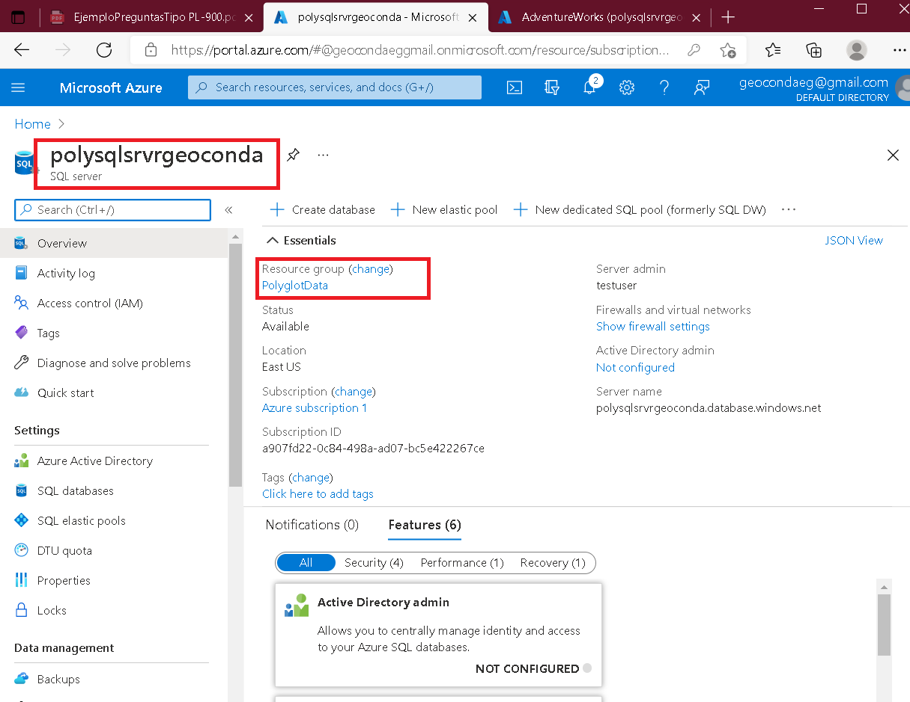

# Lab 04: Constructing a polyglot data solution
### Arquitectura


## Exercise 1: Creating database resources in Azure



* PRIMARY CONNECTION STRING *
```
AccountEndpoint=https://polycosmosgeoconda.documents.azure.com:443/;AccountKey=sSvRzn4bej1NtJaviUgkMqQbZBNohJDeN5nKm1lafGW5Qd1JKxwMqEx1y4RhtYWKwfaffMRGqG8F358l7bKeOA==;

```

## Exercise 2: Import and validate data

