# Lab 04: Constructing a polyglot data solution
### Arquitectura


## Exercise 1: Creating database resources in Azure

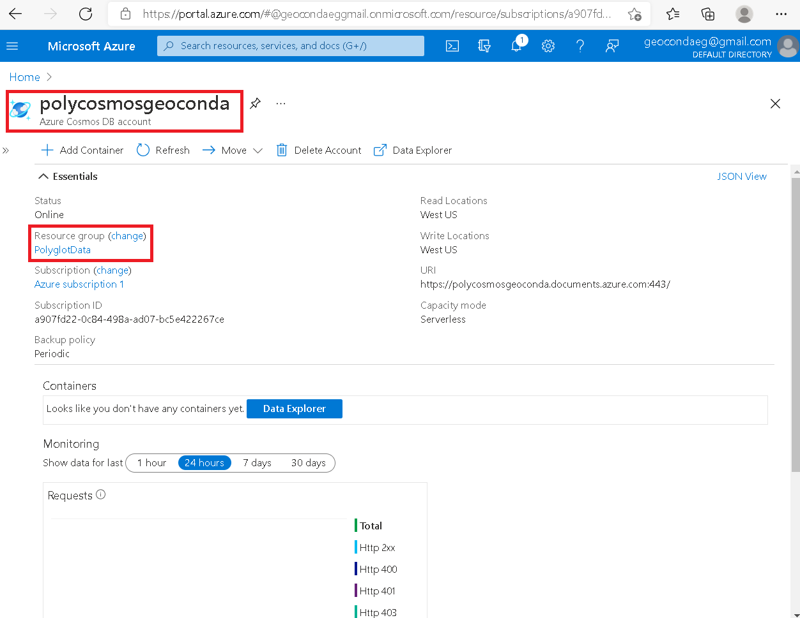


* PRIMARY CONNECTION STRING 
```
AccountEndpoint=https://polycosmosgeoconda.documents.azure.com:443/;AccountKey=sSvRzn4bej1NtJaviUgkMqQbZBNohJDeN5nKm1lafGW5Qd1JKxwMqEx1y4RhtYWKwfaffMRGqG8F358l7bKeOA==;

```

## Exercise 2: Import and validate data
* Entro a mi polystorgeoconda a traves de de mi resource groups llamado PolygotData 
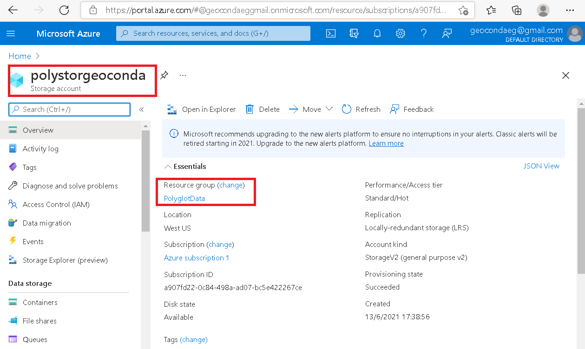
* Ceo 2 contenedores llamados "images" y "databases"
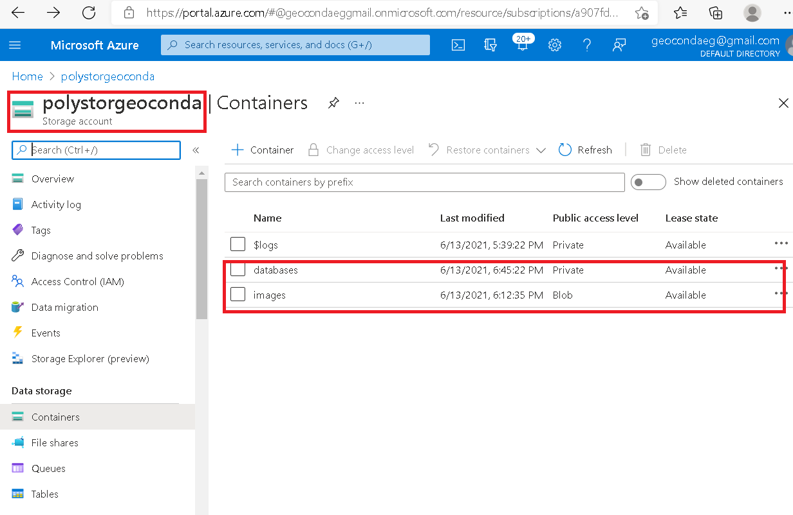
* En mi contenedor llamado images copio el Blob Servive que esta en Endpoints 
```
https://polystorgeoconda.blob.core.windows.net/images
```
* Subo todas la imagenes que tengo en mi carpeta  C:Allfiles\Labs\04\Starter\Images 
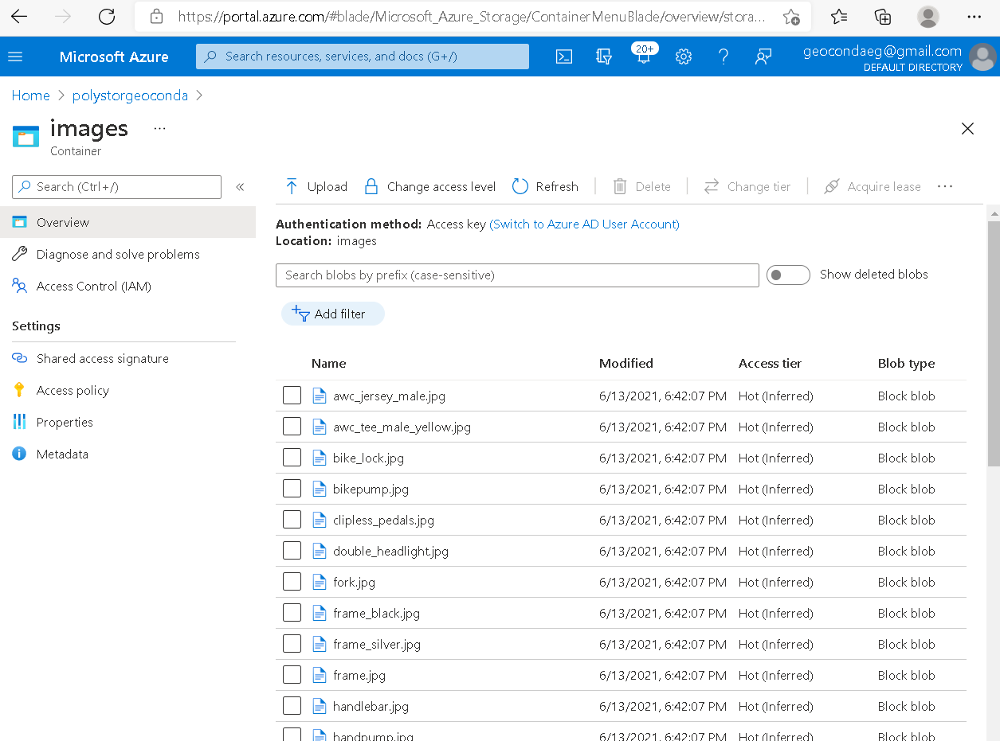
* En el contenedor llamado databases subo el arrchivo AdventureWorks.bacpac que esta en mi C: Allfiles\Labs\04\Starter 
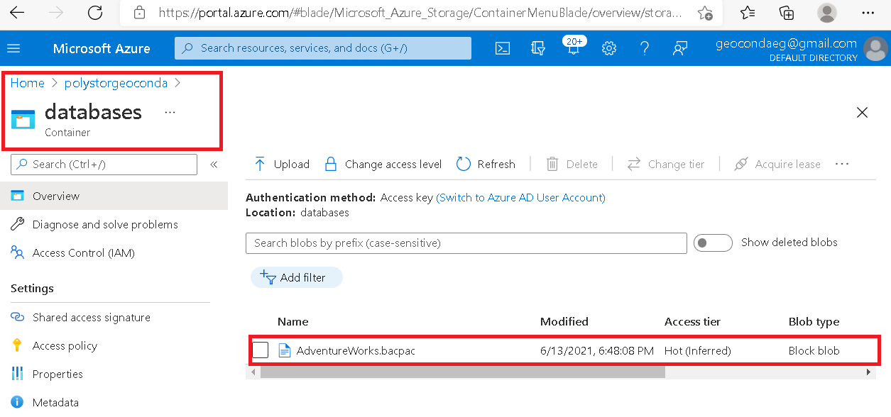
* En este paso he importado la database que teniamos en el contenedor "databases"  
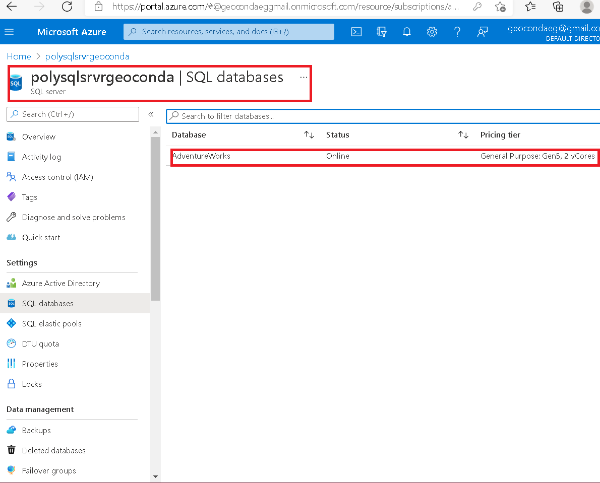
* Dentro de mi  polysqlsrvrgeoconda. selecciono la casilla de "Firewalls and virtual networks" y elijo "Add client IP"
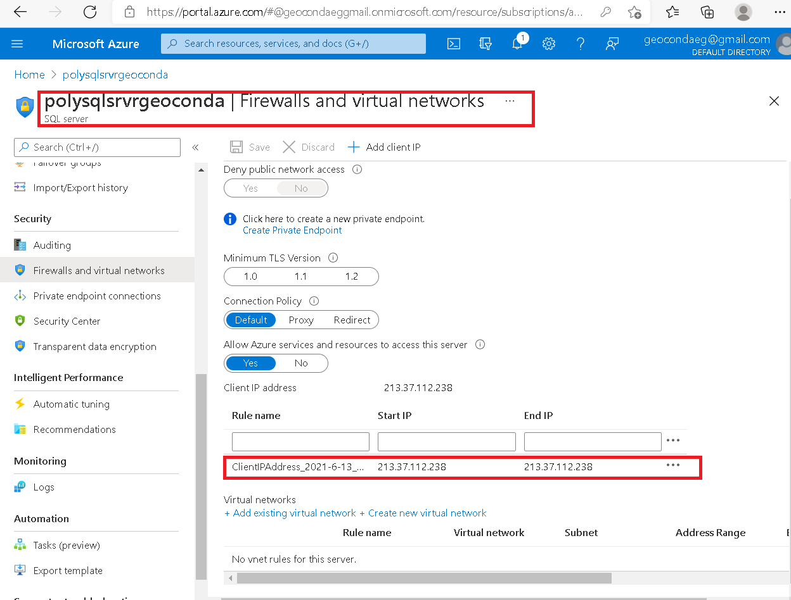
* Connection strings
 
``` 
Server=tcp:polysqlsrvrgeoconda.database.windows.net,1433;Initial Catalog=AdventureWorks;Persist Security Info=False;User ID=testuser;Password=TestPa55w.rd;MultipleActiveResultSets=False;Encrypt=True;TrustServerCertificate=False;Connection Timeout=30;
```
* Compruebo que en database haya lops archivos
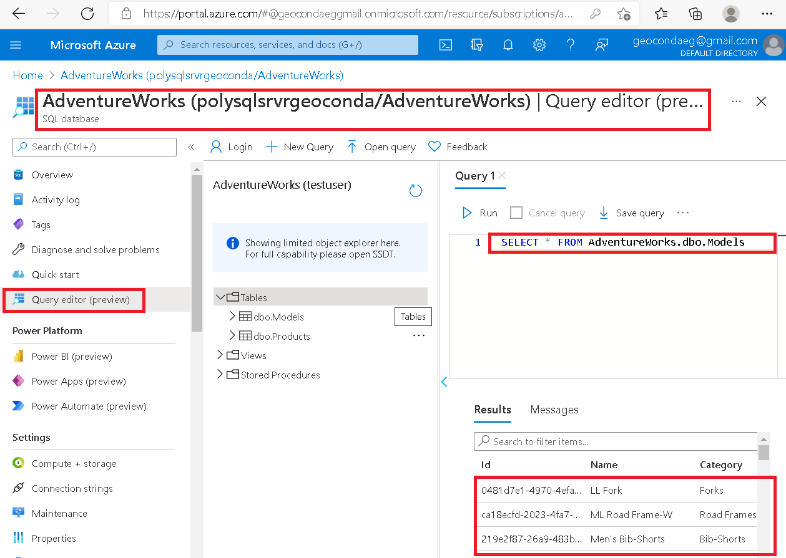
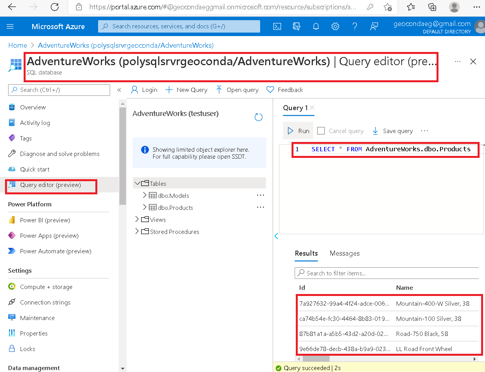

## Exercise 3: Open and configure a .NET web application
* En este punto abrimos Powershell e introducimos "dotnet build"
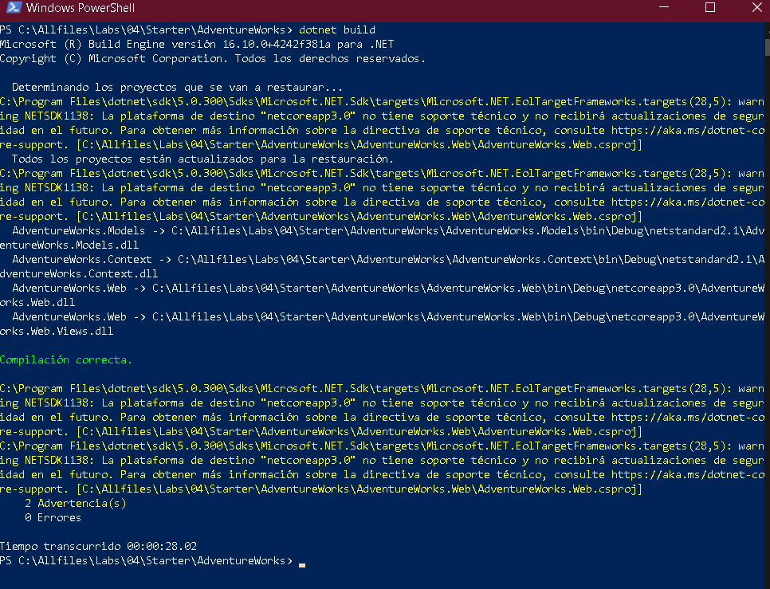
* Abrimos en Visual Studio Code la carpeta que en mi caso es (C):\Allfiles\Labs\04\Starter\AdventureWorks y modificamos el codigo usando el Connection Strings y el Blob Container Url que antes guardamos.
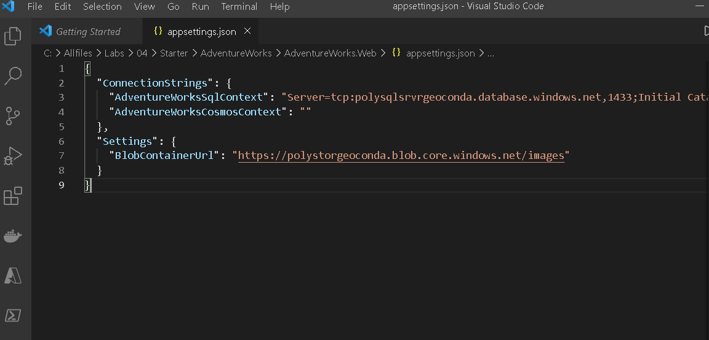
* Validar la aplicación web.
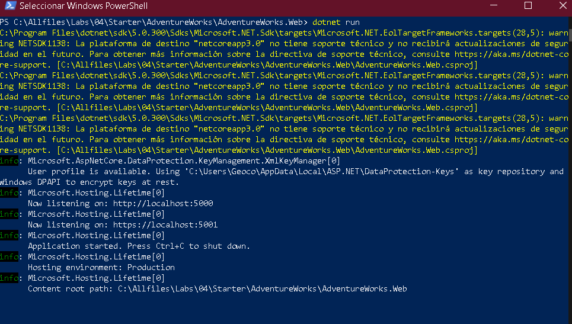
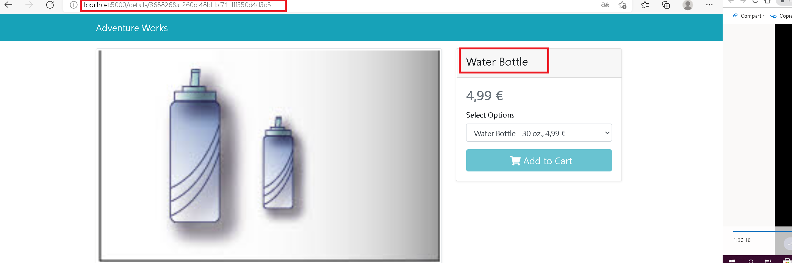
