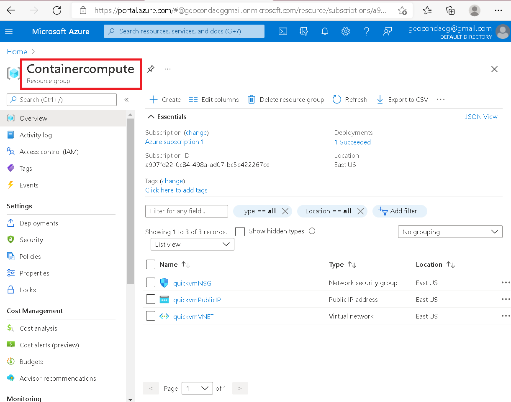
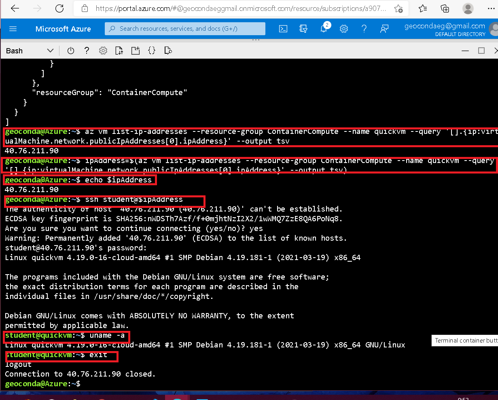
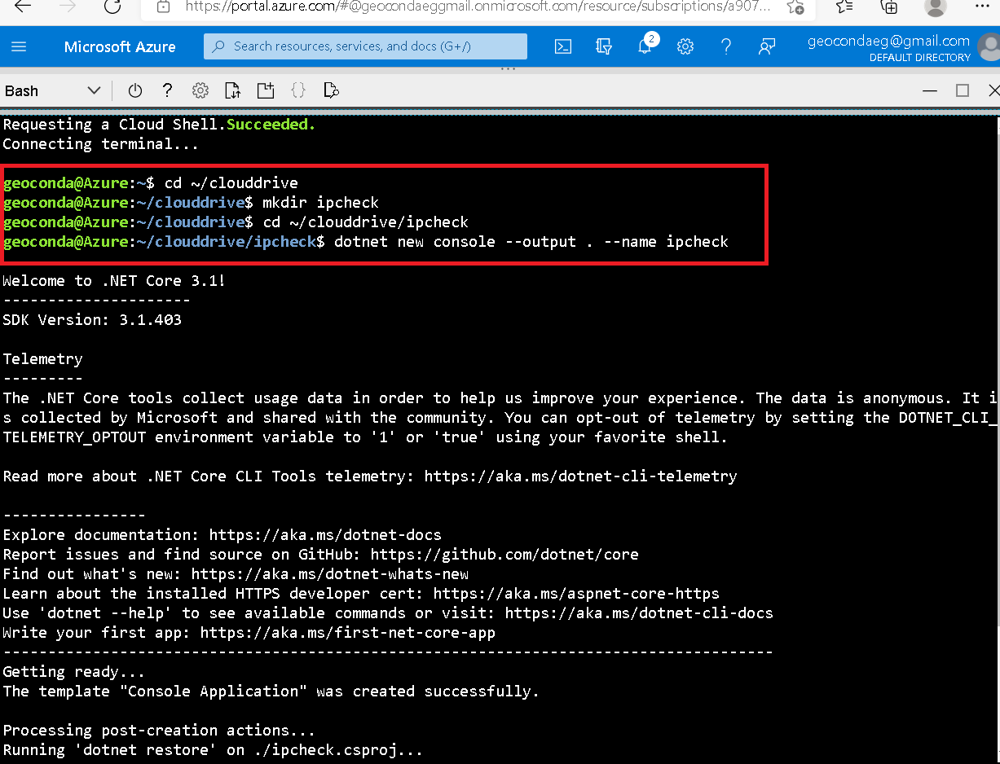
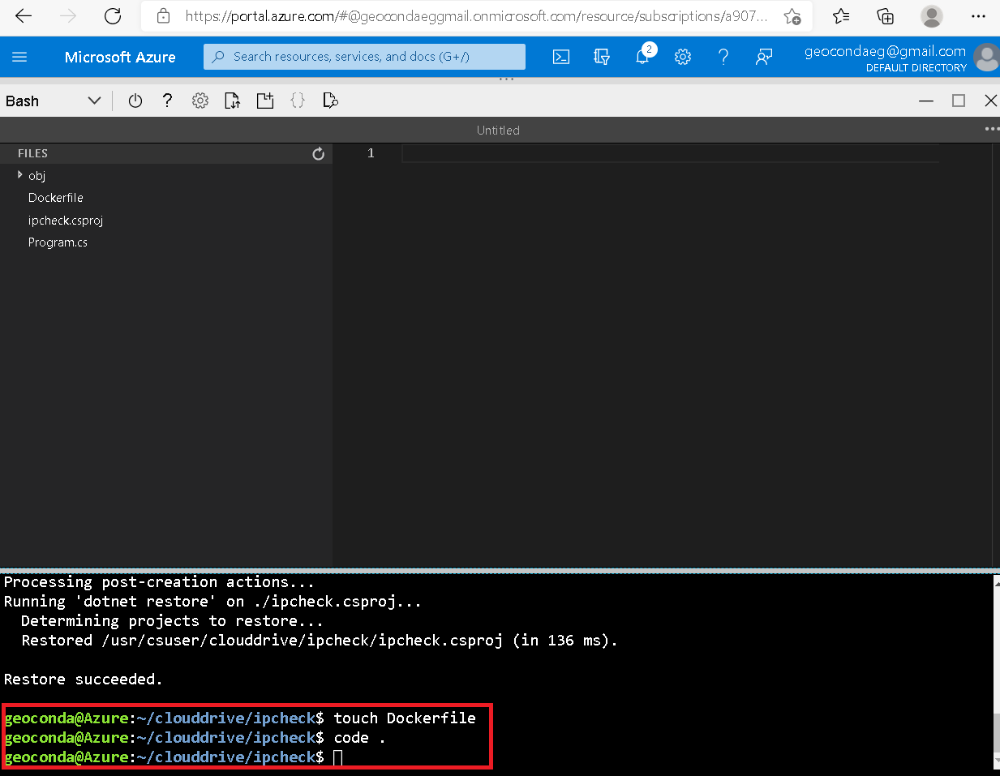
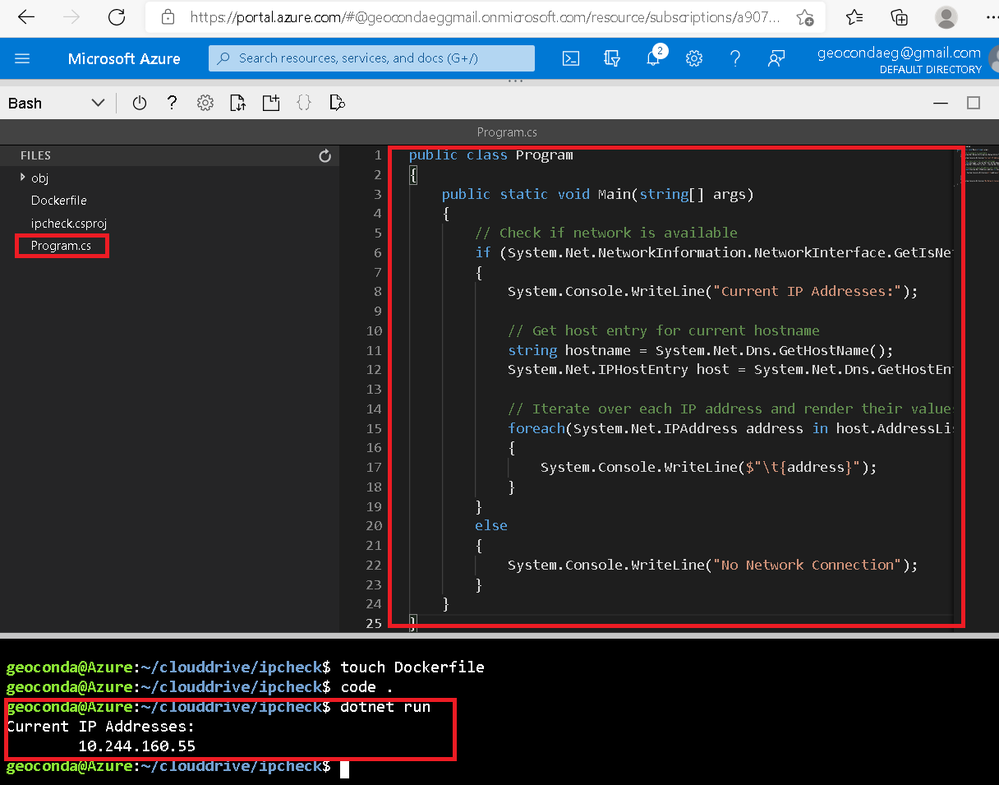
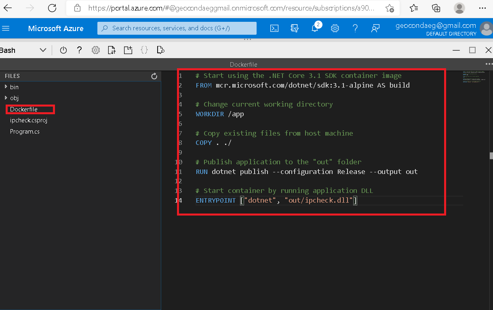
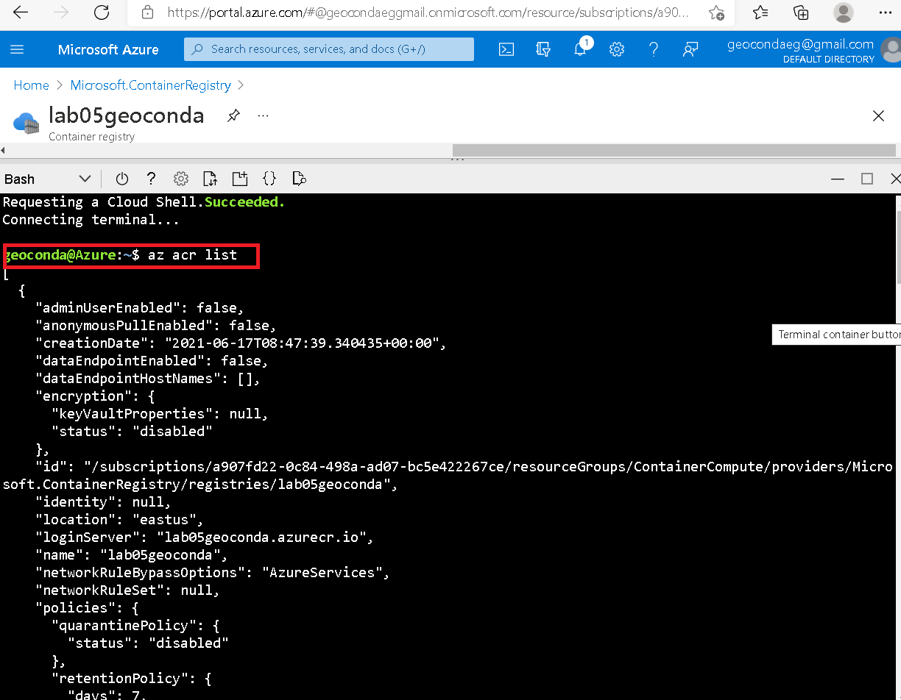

# Exercise 1: Create a VM by using the Azure Command-Line Interface (CLI)
* Creamos un grupo de recursos.

* Usando los comandos de Azure CLI para crear una maquina virtual. 

## Create a Docker container image and deploy it to Azure Container Registry

* Dentro de ~/clouddrive directory creamos un nuevo directorio llamado ipcheck, en el cual crearemos una nueva consola llamada ipcheck.

* Creo un nuevo archivo llamado  Dockerfile y abro el Visual Code de  Cloud Shell.

* Elijo  el archivo de Program.cs borro todo y le agrego nuevos códigos, lo guardo y finalizo con un dotnet run.

* En el archivo creado Dockerfile. le agregamos el siguiente código y guardo.

* Crear un Container Registry resource

* Abrir Azure Cloud Shell and store Container Registry metadata

