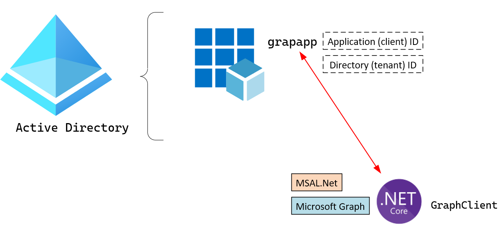

# Lab 06: Authenticating to and querying Microsoft Graph by using MSAL and .NET SDKs


## Exercise 1: Create an Azure Active Directory (Azure AD) application registration
* Creo un registro de aplicación
* 

* Estos son los valores que necesitaré para mi código.
Application (client) ID :
```
aae6149f-b87b-46d7-a65a-5487d0030313
```
Directory (tenant) ID :
```
46432455-ac40-4b4d-9765-c95cbca056bd
```
* Habilito el  de cliente predeterminado.


## Exercise 2: Obtain a token by using the MSAL.NET library
* Creo un .NET project con los siguientes comandos.


* Dentro de mi proyecto creado, modifico el código de mi Program.cs (En esta actividad utilizaré los valores guardados.)


* Lo ejecuto.


* Me redirige a mi navegador para queinicie sesión mi cuenta.


## Exercise 3: Query Microsoft Graph by using the .NET SDK
* Importo el SDK de Microsoft Graph desde NuGet


 
 * Modifico el Program class para usar el SDK de Microsoft Graph para consultar información de perfil del usuario.
 
 
 * Pruebo la actualización de la aplicación.

