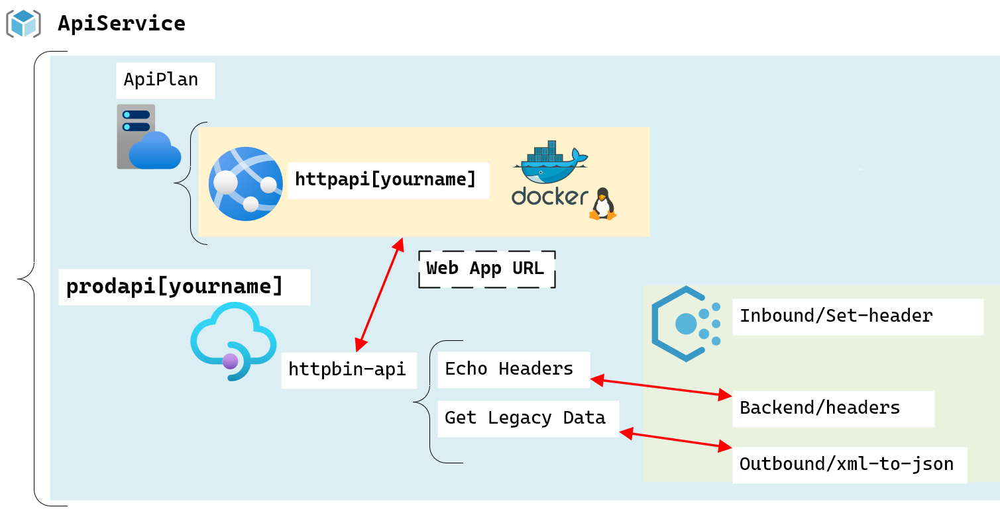
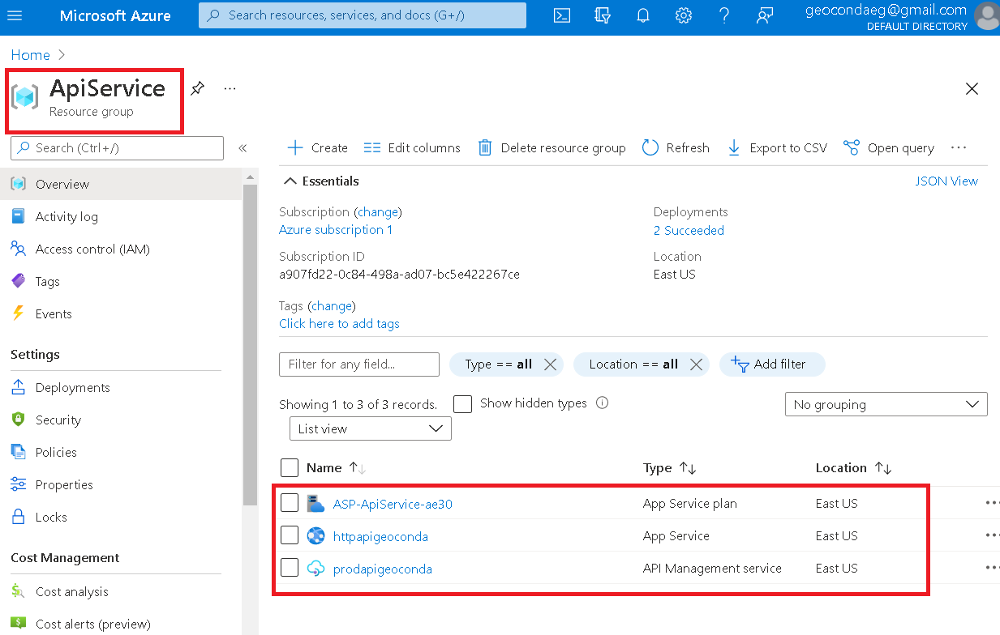
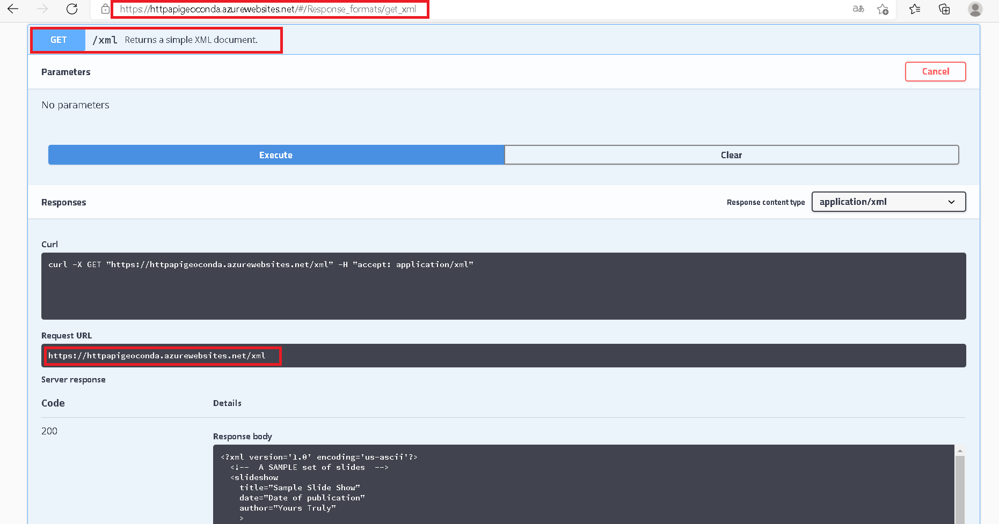
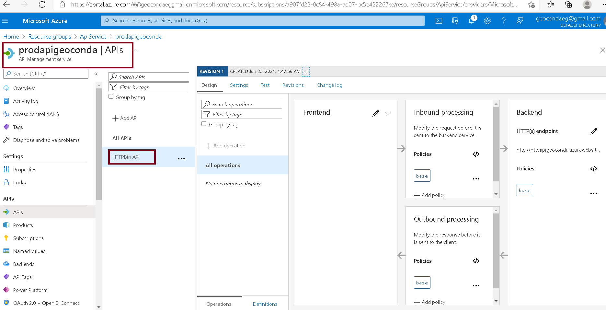
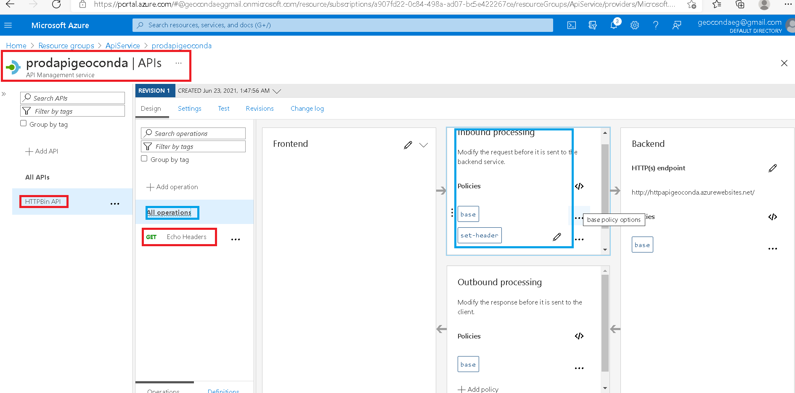
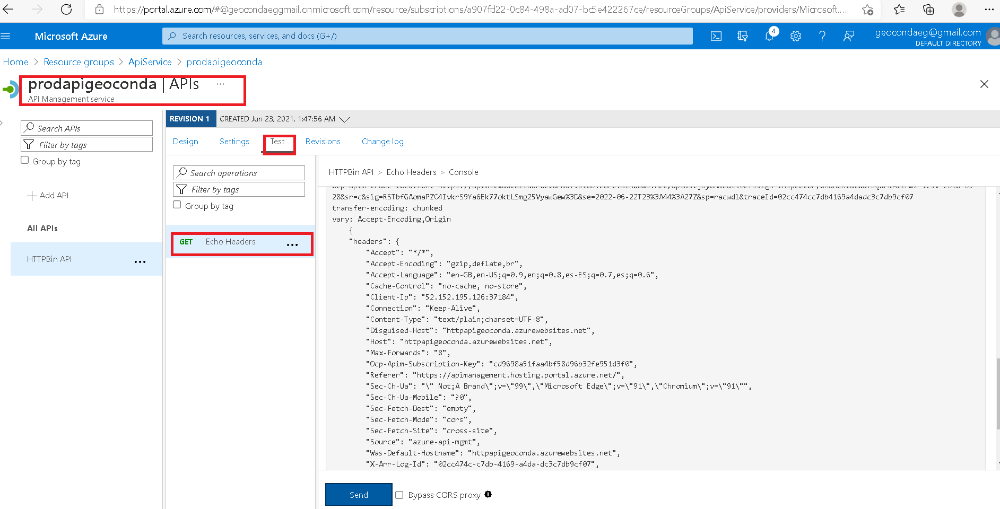
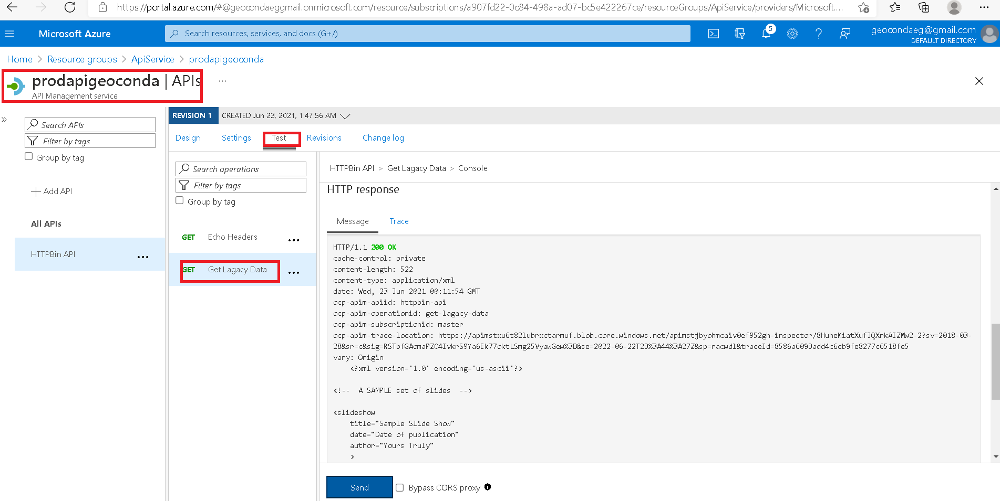
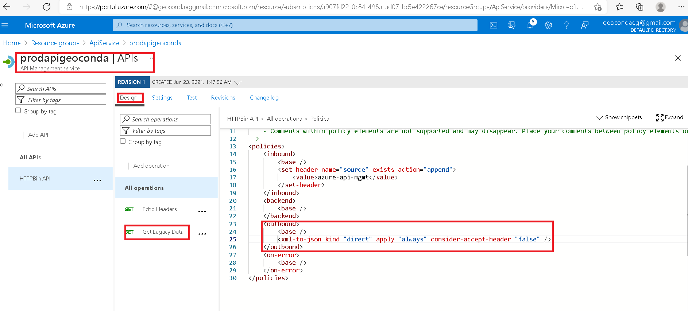
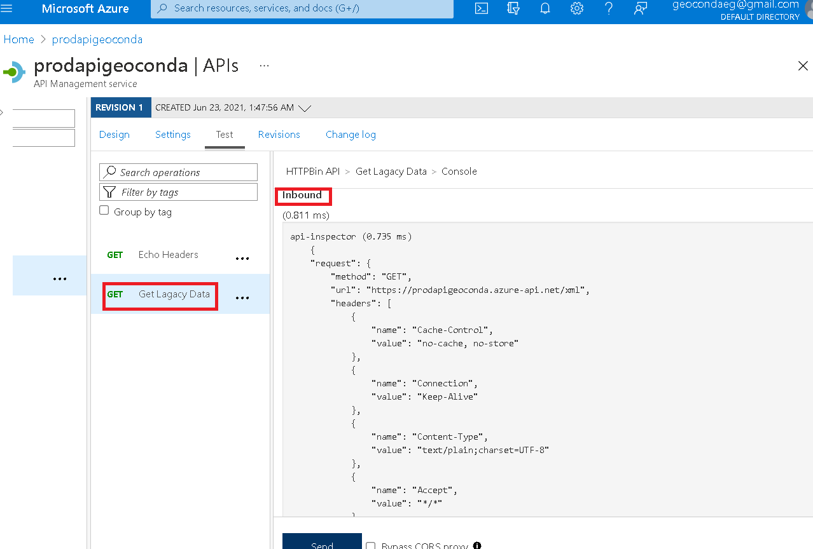
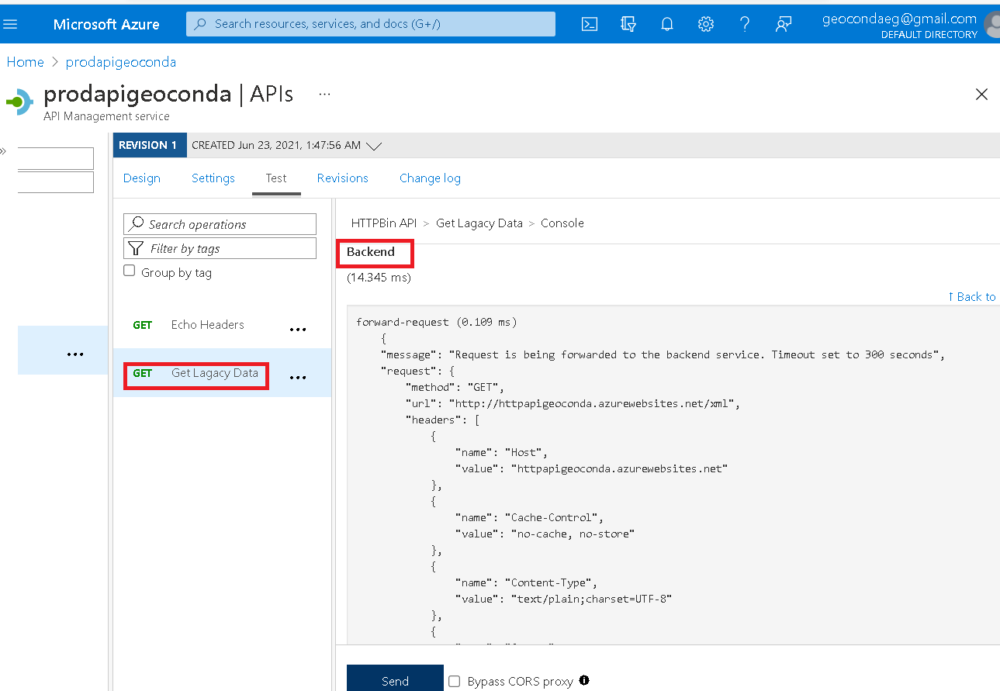

# Lab 08: Creating a multi-tier solution by using services in Azure


### Exercise 1: Creating an Azure App Service resource by using a Docker container image
* Creo un grupo de recurso junto con una Api Service y una API Management. 

* Test the httpbin web application



## Exercise 2: Build an API proxy tier by using Azure API Management
* Dentro de mi API Management creo una Blank API llamada httpbin-ap

Properties URL: 
```
http://httpapigeoconda.azurewebsites.net/
 ```
 * En mi Blank API creada, añadiré una operación una política.


* Seleciono Echo Headers y busco Backend, lo edito pàra agregar un nuevo valor.


* Estos son los resultados de mi API creada.


 * Asi mismo creo una mnueva operación llamada Get Legacy Data y veo sus resultados también.


*  En esta ultima operación creada  agrego una  nueva politica donde tendré que editar el código, quedando de esta manera:

* Compruebo que al cambiar el código se cree un formato .JSON

* Por último, observo el contenido del Backend y del Outbound.



