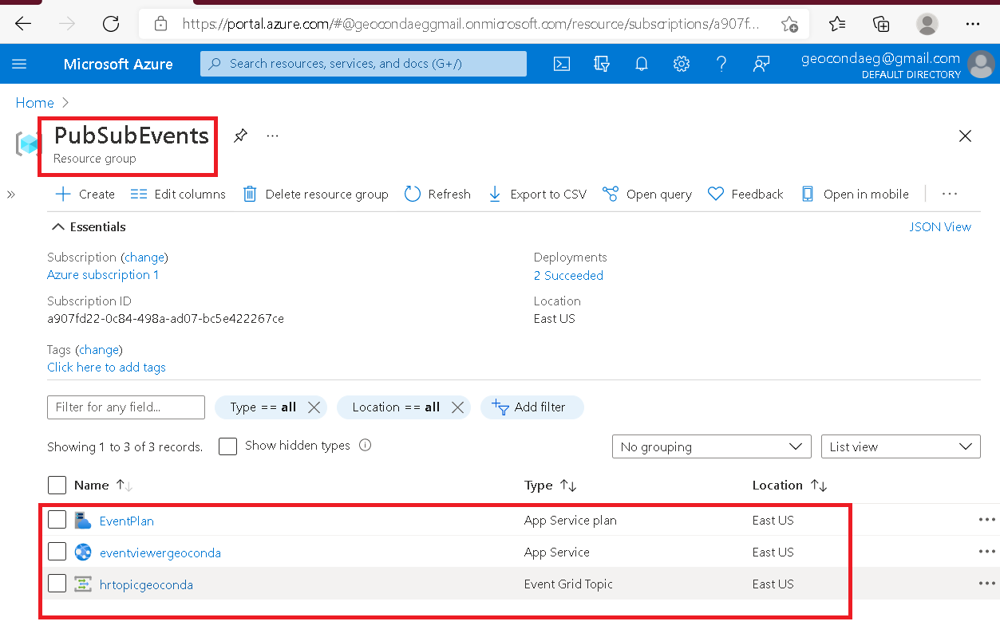
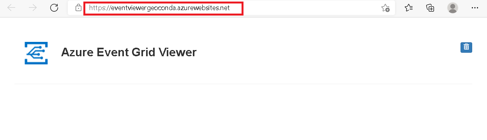
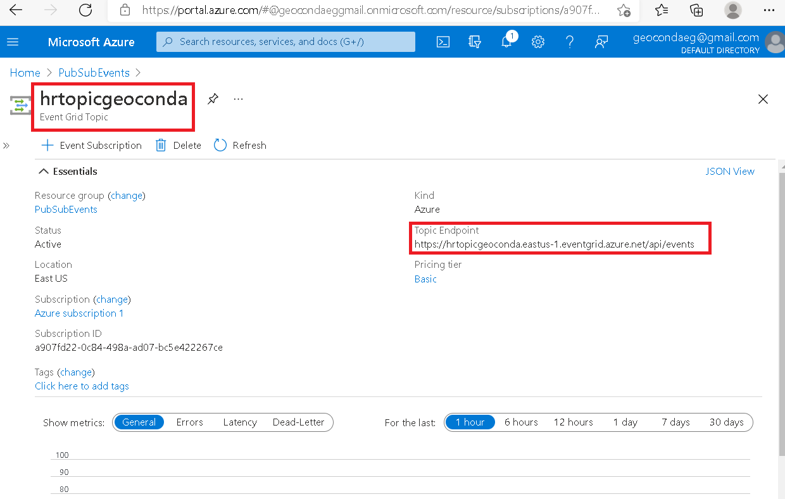
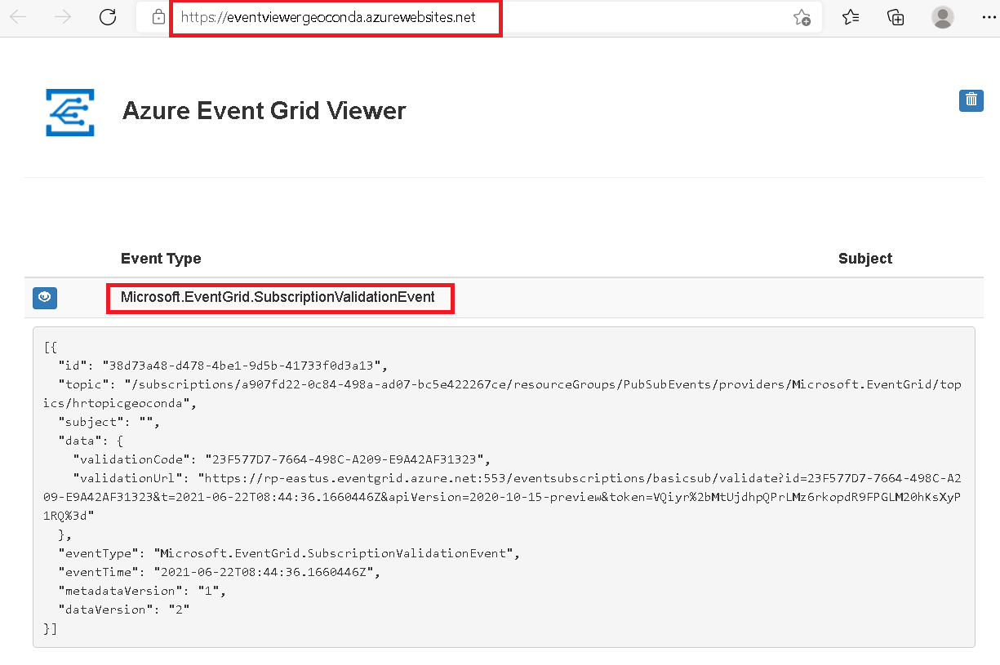
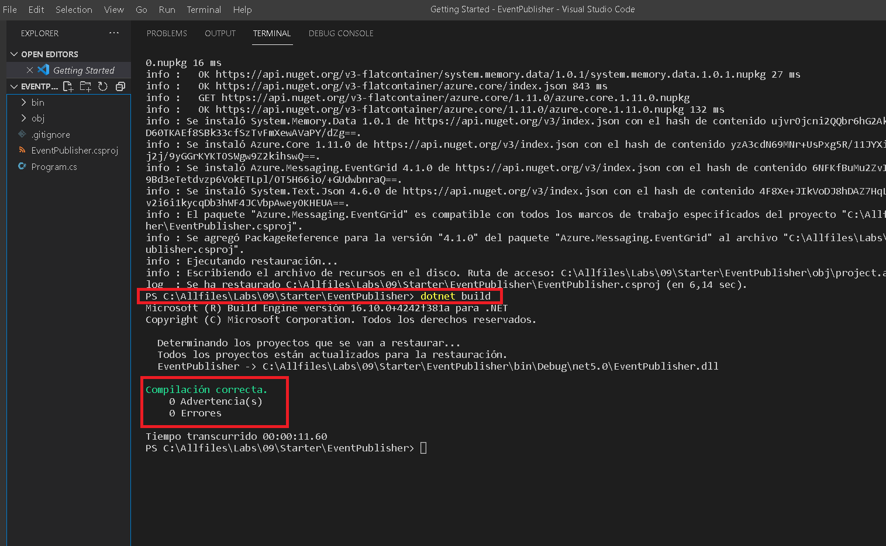
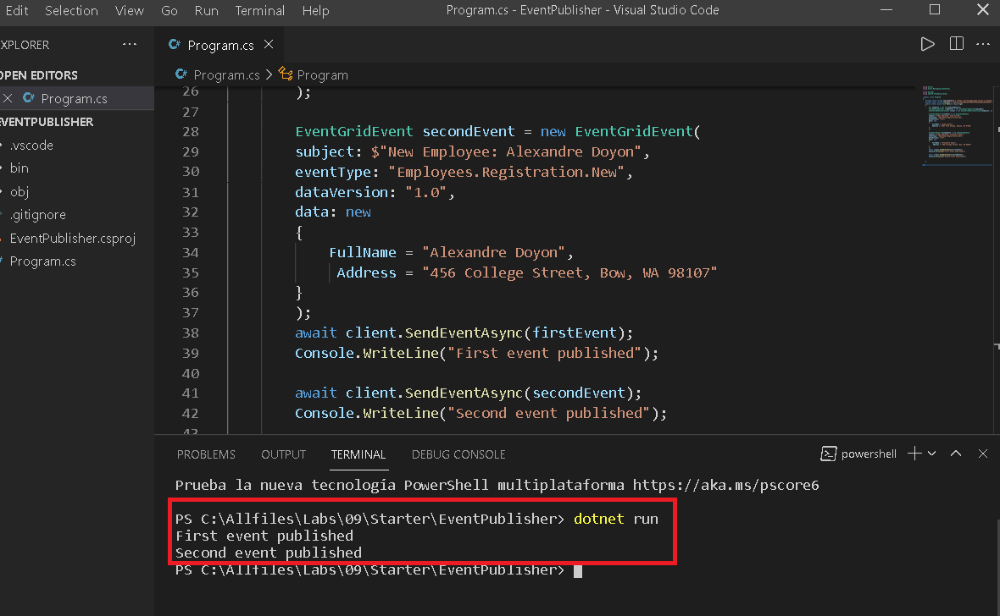
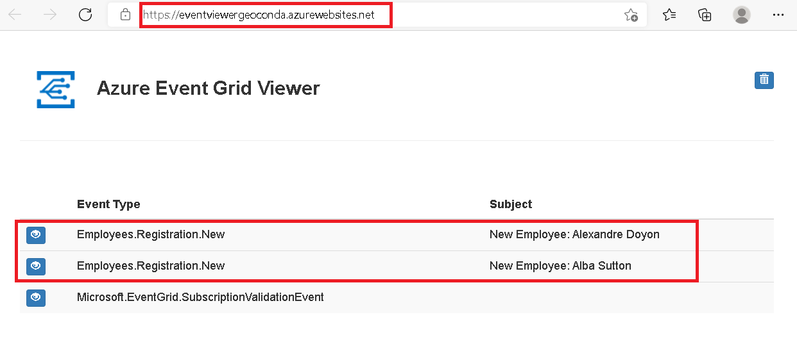

# Lab 09: Publishing and subscribing to Event Grid events


### Exercise 1: Create Azure resources

* Dentro de mi grupo de recursos llamado PubSubEvents, creo un Event Grid Topic y una Web App en donde almacenaré mi Event Grid.


### Exercise 2: Create an Event Grid subscription
* Observo en mi web app, que el Event Grid ya se visualiza. 


* Creo una nueva suscripción, la cual saldrá en mi "Topic Endpoint"


* Observo el evento de validación de mi suscripción.


### Exercise 3: Publish Event Grid events from .NET
* Creo un .NET project



 
* Dentro de mi .NET project, modifico el código de mi  Program.cs
```
 using Azure;
 using Azure.Messaging.EventGrid;

 using System;
 using System.Threading.Tasks;

  public class Program
 {
    private const string topicEndpoint = "https://hrtopicgeoconda.eastus-1.eventgrid.azure.net/api/events";
    private const string topicKey = "KgHrASIfUpVvRMDcqzXYNW4/MZY8JpLMhpyxBswUZeM=";
    public static async Task Main(string[] args)
    {
        Uri endpoint = new Uri(topicEndpoint);
        AzureKeyCredential credential = new AzureKeyCredential(topicKey);
        EventGridPublisherClient client = new EventGridPublisherClient(endpoint, credential);

        EventGridEvent firstEvent = new EventGridEvent(
        subject: $"New Employee: Alba Sutton",
        eventType: "Employees.Registration.New",
        dataVersion: "1.0",
        data: new
        {
            FullName = "Alba Sutton",
            Address = "4567 Pine Avenue, Edison, WA 97202"
        }
        ); 

        EventGridEvent secondEvent = new EventGridEvent(
        subject: $"New Employee: Alexandre Doyon",
        eventType: "Employees.Registration.New",
        dataVersion: "1.0",
        data: new
        {
            FullName = "Alexandre Doyon",
             Address = "456 College Street, Bow, WA 98107"
        }
        ); 
        await client.SendEventAsync(firstEvent);
        Console.WriteLine("First event published");

        await client.SendEventAsync(secondEvent);
        Console.WriteLine("Second event published");

 
    }

 }
 ```
 
 * Estos son los valores que he agregado a mi código.
 ```
Topic Endpoint:
https://hrtopicgeoconda.eastus-1.eventgrid.azure.net/api/events

Access Key 1 :
KgHrASIfUpVvRMDcqzXYNW4/MZY8JpLMhpyxBswUZeM=
```

* Finalmente observo como aparecen mis nuevas publicaciones.


