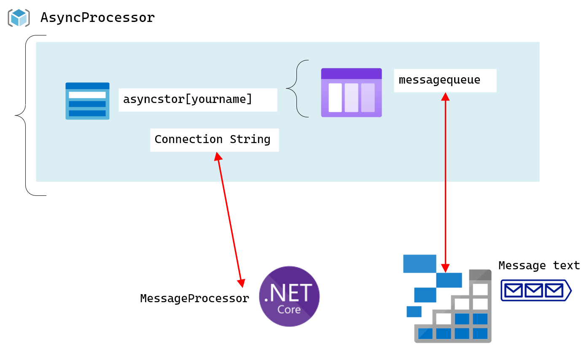
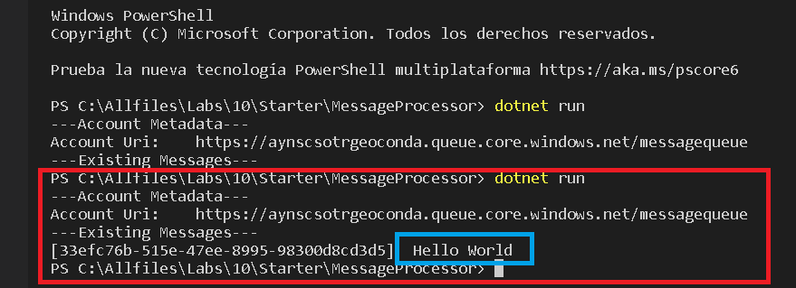

# Lab 10: Asynchronously processing messages by using Azure Queue Storage.

## Exercise 1: Create Azure resources
* Hago una cuenta de almacenamiento dentro de un grupo de recursos llamado AsyncProcessor. 


## Exercise 2: Configure the Azure Storage SDK in a .NET project

* Creo una nueva consola llamada MessageProcessor

*  En mi codigo necesitaré la Connection String que he sacado de mi cuenta de almacenamiento.
  ```
  DefaultEndpointsProtocol=https;AccountName=aynscsotrgeoconda;AccountKey=tWa87pSEpj8SlxFt34XOnQR3Dt1E757bVNDqU5+ZJgcf3g+5XLy0CsjBgWkWAJpee9odtGNWclJmRt106aNa6Q==;EndpointSuffix=core.windows.net

  ```
  
* Dentro del archivo que he creado, modifico el documento llamado Program.cs 

## Exercise 3: Read messages from the queue
* Escribo el código para acceder a mi queue message

* Accedo a mi cuenta de almacenamiento y abro el programad e Azore Storage Explorer y creo un mesaage text con los siguiente valores

* Compruebo que el mensaje que creé, aparece


* Le aplicamos un código apra que borre los mensajes

## Exercise 4: Queue new messages by using .NET
* Dentro de mi8 método main le pongo un código para que cree un mensaje nuevo.

* Finalmente compruebo en mi Storage Explorer que salen los mensajes que he creado. (Posteriormente el mensaje de "Hello, World" desaparecerá. 

