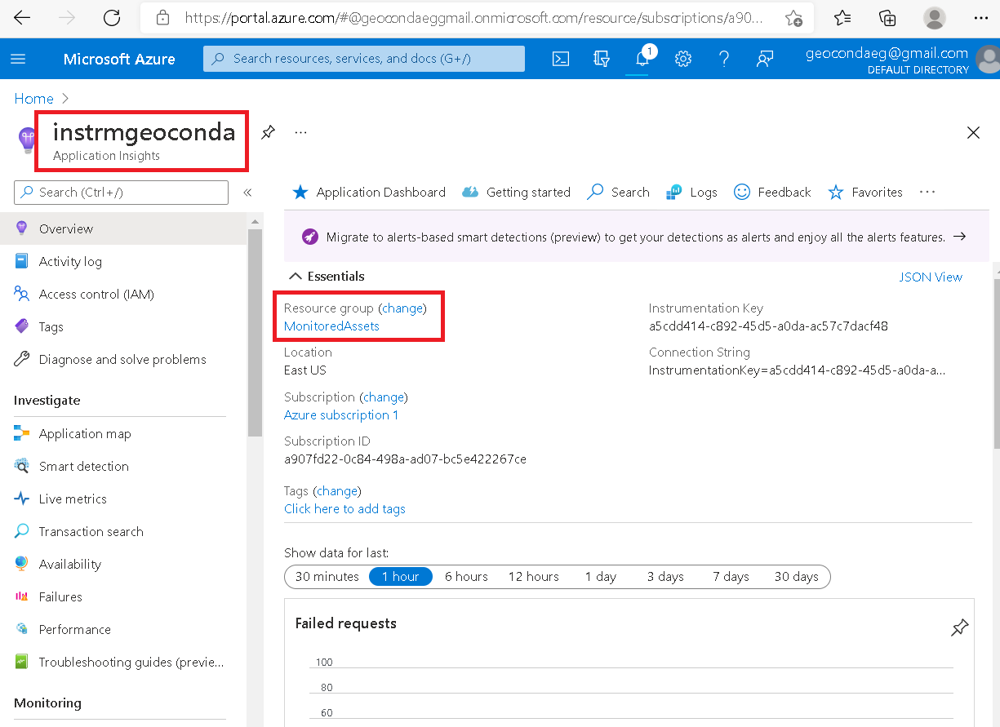
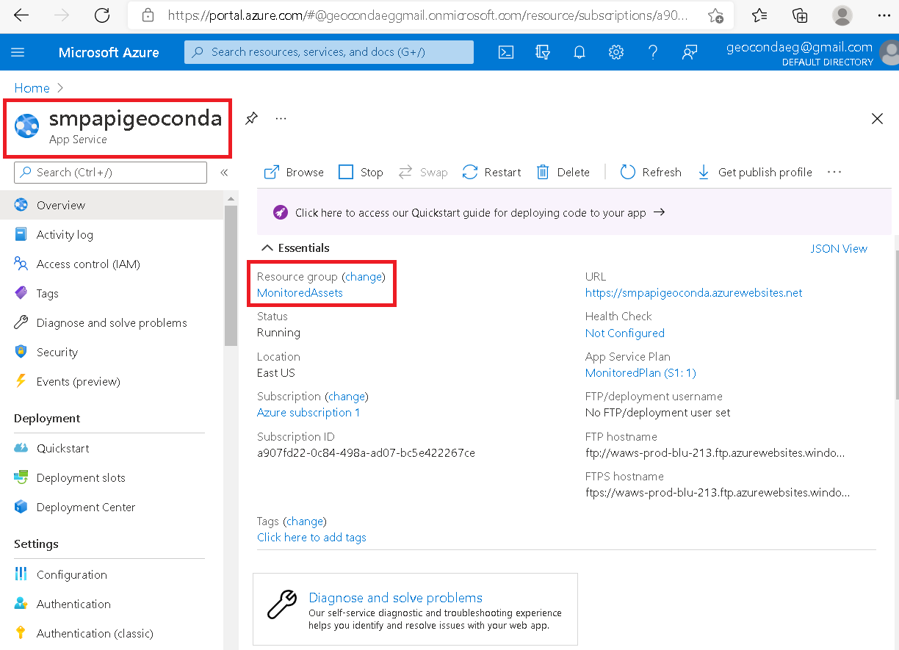
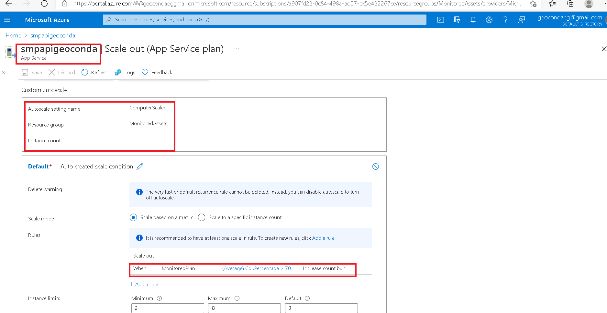
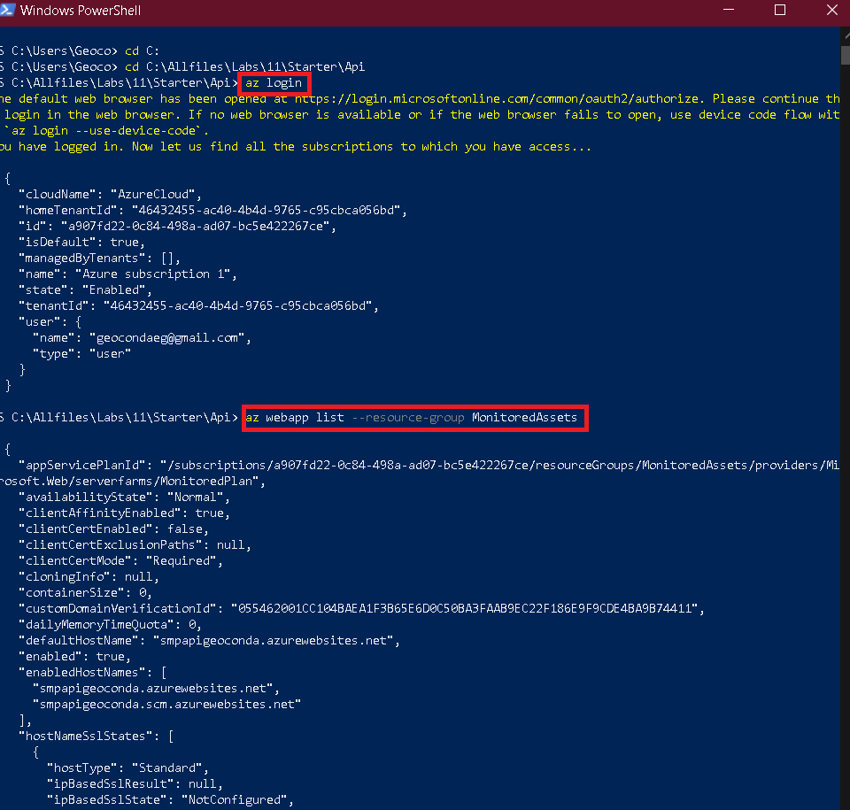
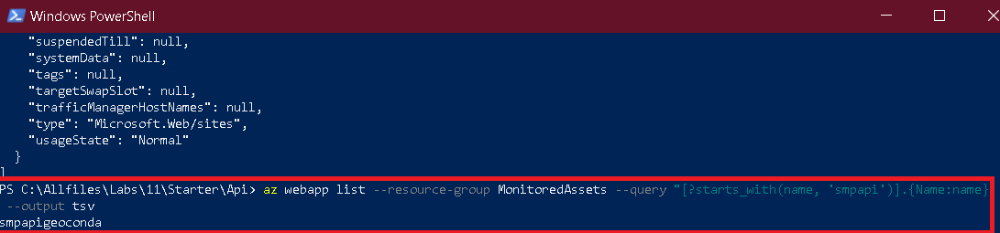
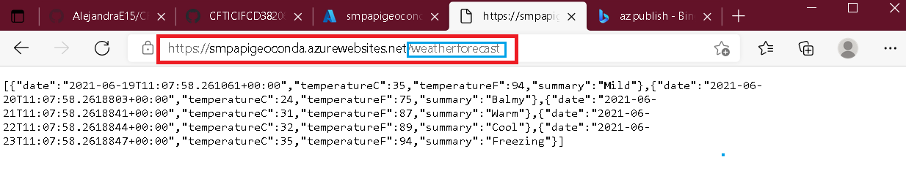
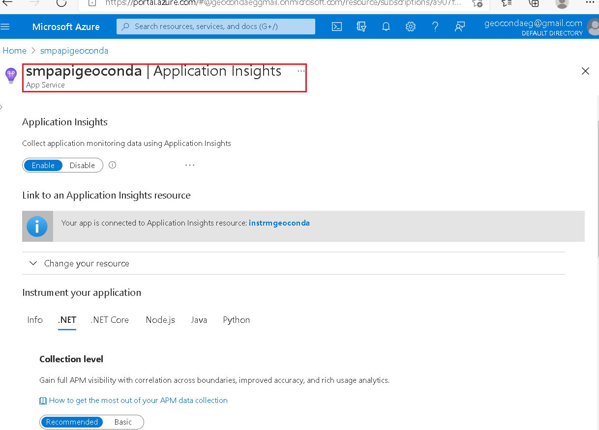
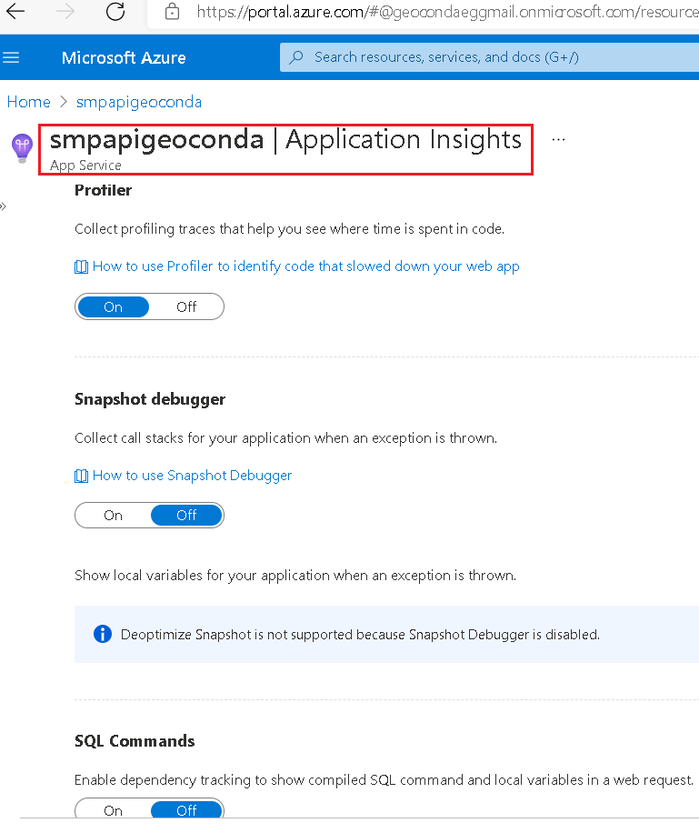
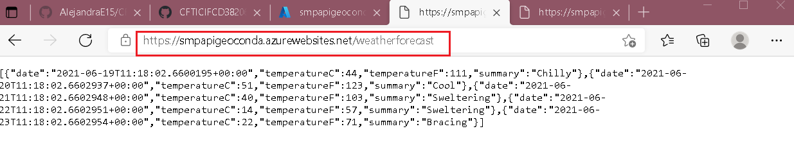
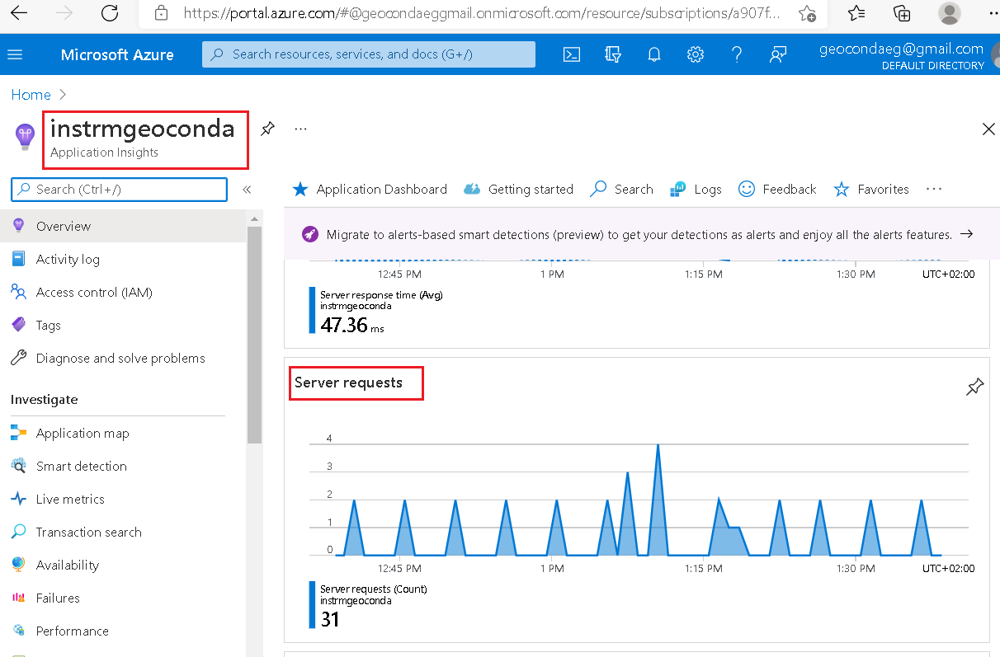

# Lab 11: Monitoring services that are deployed to Azure


### Exercise 1: Create and configure Azure resources

* Creo una Application Insights resource


* Creo una App Service.


* Configuración de las opciones de escalado automático de aplicaciones web


### Exercise 2: Monitor a local web application by using Application Insights
* Build a .NET Web API project


* Registro mi nuevo proveedor.


* Creo un CDN profile.


### Exercise 3: Upload and configure static web content

* Observo mi pagina web, la cual aun no tiene contenido. 


* En mi contenedor llamado media, subo unas imágenes jpd de mi práctica.


* Por otra lado en mi contenedor llamado video, también subo un archivo mp4 .


* Configuro en los ajustes de mi Web app, añadiendo 2 aplicaciones con los valores de los contenedores creados anteriormente.


* Compruebo que mis archivos se hayan subido a mi página web.


### Exercise 4: Use Content Delivery Network endpoints

* Pruebo mi contenido multimedia con los siguientes enlaces y si funcionan.


```
https://cdnmediageoconda.azureedge.net/campus.jpg
```

```
https://cdnmediageoconda.azureedge.net/conference.jpg
```

```
https://cdnmediageoconda.azureedge.net/poster.jpg
```

```
https://cdnvideogeoconda.azureedge.net/welcome.mp4
```
* Actualizo las configuraciones de mi aplicación web con los calores sacados de mi CDN profile de media y video.


* Finalmente corroboro que mi pagina fucniona correctamente con el enlace de mi CDNweb.

