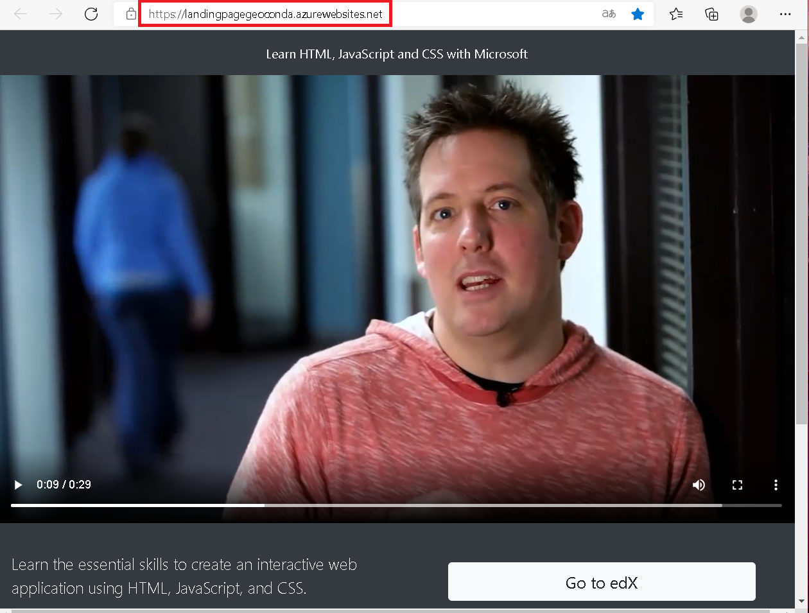
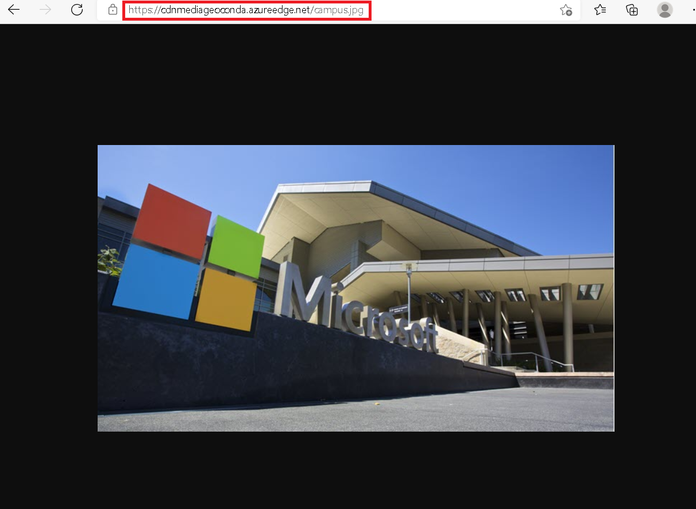
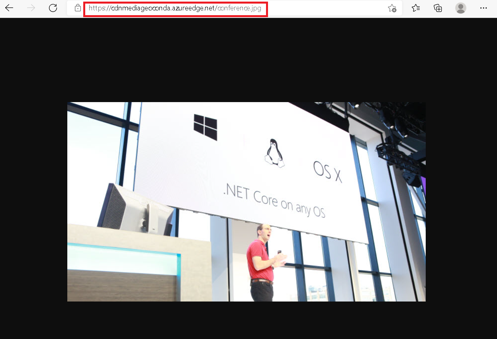
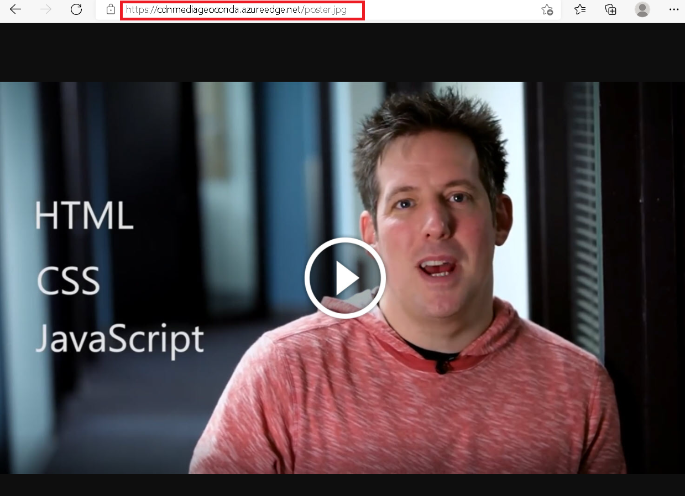
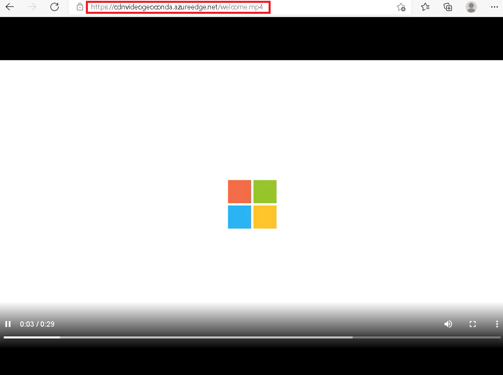
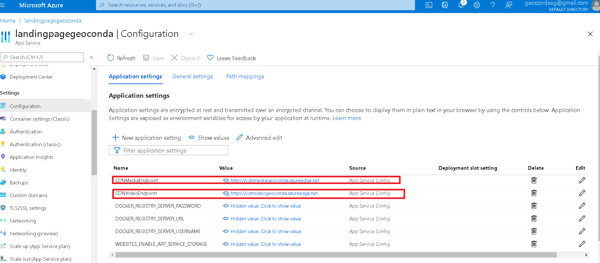
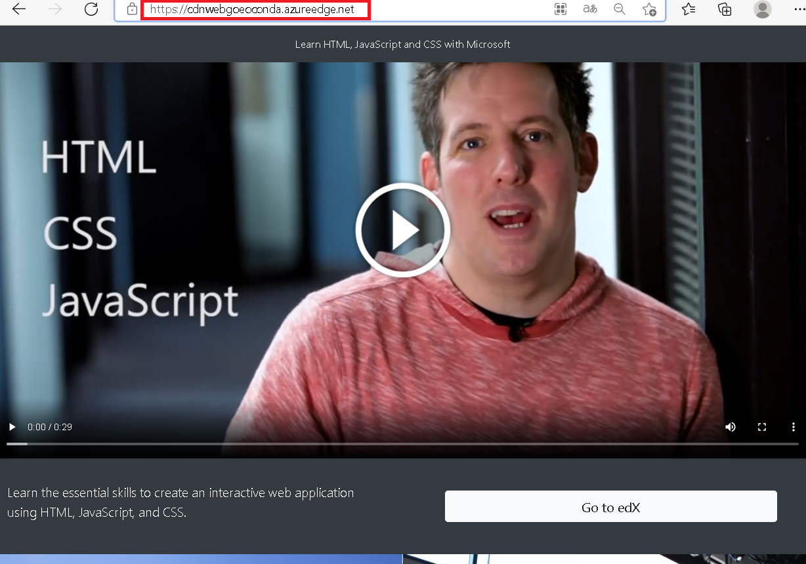

# Lab 12: Enhancing a web application by using the Azure Content Delivery Network


### Exercise 1: Create Azure resources


* Properties URL de mi web app.

```
http://landingpagegeoconda.azurewebsites.net/
```
### Exercise 2: Configure Content Delivery Network and endpoints 
* Compruebo que el provedor Microsoft.CDN no este creado.


* Registro mi nuevo proveedor.


* Creo un CDN profile.


* En mi grupo de recursos creo dos contenedores llamados media y video.


* Dentro de mi CDN profile agrego 3 Endpoint, basados en mis 2 contenedores y mi web app.


### Exercise 3: Upload and configure static web content

* Observo mi pagina web, la cual aun no tiene contenido. 


* En mi contenedor llamado media, subo unas imágenes jpd de mi práctica.


* Por otra lado en mi contenedor llamado video, también subo un archivo mp4 .


* Configuro en los ajustes de mi Web app, añadiendo 2 aplicaciones con los valores de los contenedores creados anteriormente.


* Compruebo que mis archivos se hayan subido a mi página web.


### Exercise 4: Use Content Delivery Network endpoints

* Pruebo mi contenido multimedia con los siguientes enlaces y si funcionan.


```
https://cdnmediageoconda.azureedge.net/campus.jpg
```

```
https://cdnmediageoconda.azureedge.net/conference.jpg
```

```
https://cdnmediageoconda.azureedge.net/poster.jpg
```

```
https://cdnvideogeoconda.azureedge.net/welcome.mp4
```
* Actualizo las configuraciones de mi aplicación web con los calores sacados de mi CDN profile de media y video.


* Finalmente corroboro que mi pagina fucniona correctamente con el enlace de mi CDNweb.



